# Taller 1 – Laboratorio "Caso de Estudio Forense"

- MY. ANTOLINEZ DÍAZ RAÚL ORLANDO
- MY. CADAVID YACOMELO JASSED DAVID
- MY. CORREA MESA LEONARDO
- MY. ARIAS CUELLAR JUAN CARLOS
- CC. CARRASCAL ORTIZ MAURICIO DAVID

---

## OBJETIVO

Analizar un disco flexible recuperado y responder las siguientes preguntas.

- ¿Quién es el proveedor de marihuana de Joe Jacobs y cuál es la dirección listada del proveedor?
- ¿Qué dato crucial está disponible dentro de coverpage.jpg y porque el dato es crucial?
- ¿Qué (si hay) otras escuelas vecinas a Snith Hill Joe Jacobs frecuentan?
- Para cada archivo, que procesos hizo el sospechoso para enmascarar de otros.
- ¿Qué procesos (usted como analista) realizó para examinar el contenido completo de cada archivo?

---

## DESARROLLO DEL LABORATORIO

### Descarga del archivo

[https://github.com/SVelizDonoso/forense-autopsy/blob/master/image.zip](https://github.com/SVelizDonoso/forense-autopsy/blob/master/image.zip)

### Comprobación de integridad

Para comprobar la integridad del archivo descargado "image.zip", se utilizó el comando `Get-FileHash` desde PowerShell.

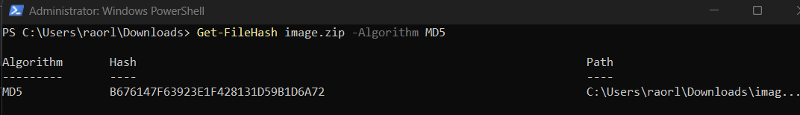

Una vez comprobada la integridad del archivo descargado, se procede a realizar una copia adicional de la evidencia, seguido de esto, se extrae el contenido del archivo `image.zip`.

Se crea la siguiente carpeta para insertar la información extraída: `C:\Users\raorl\Downloads\Taller Autopsy`

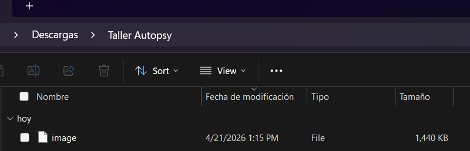

### Inicio de Autopsy

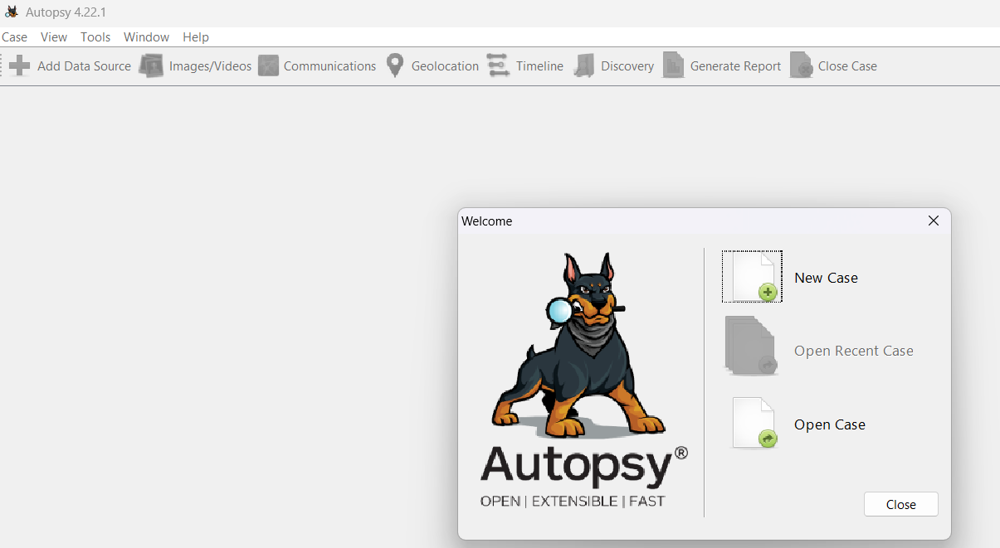

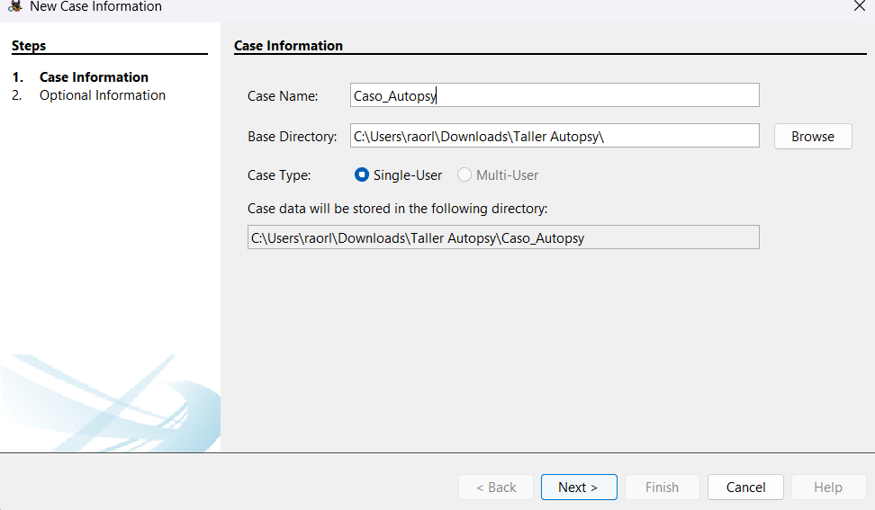

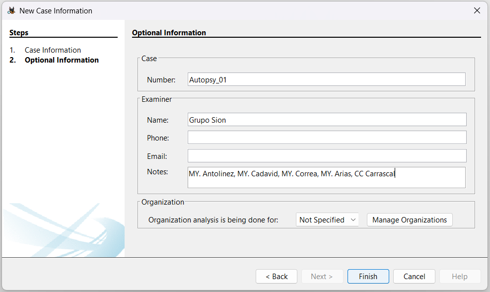

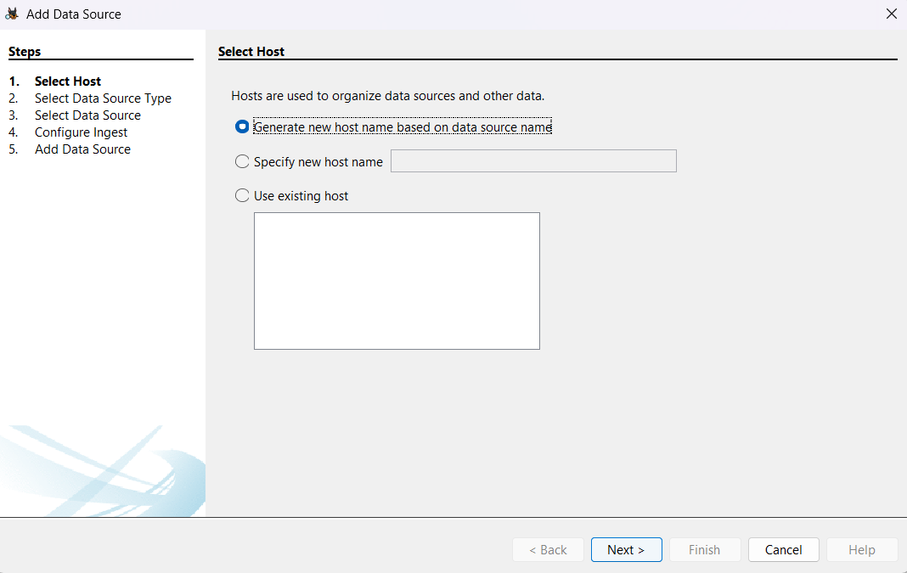

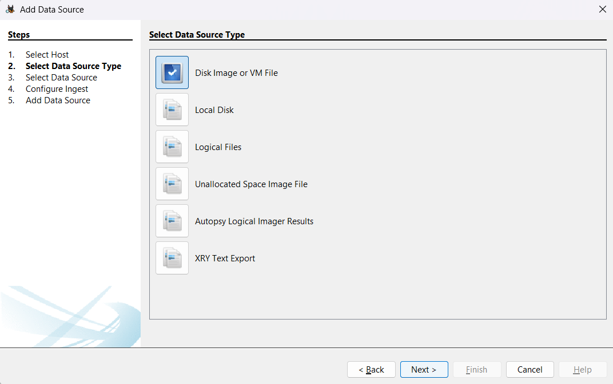

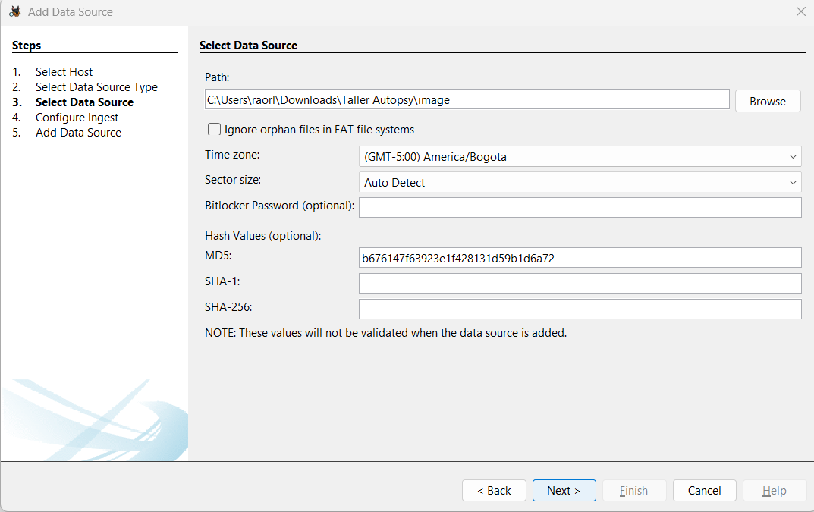

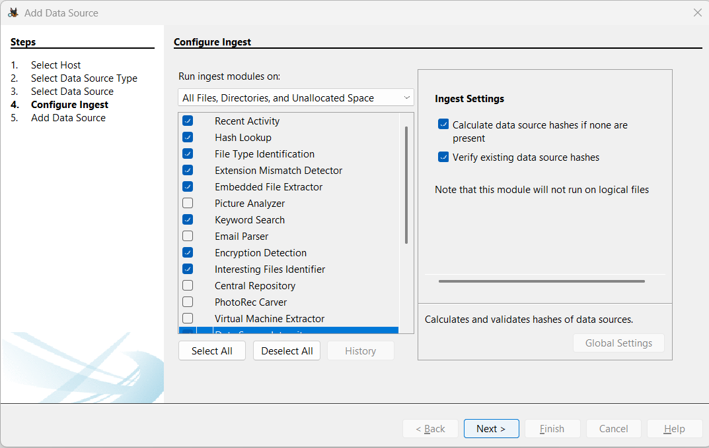

La configuración de ingesta es una de las etapas más críticas en el análisis forense digital, ya que determina qué procesos automatizados ejecutará la herramienta para extraer, indexar y categorizar la evidencia sin alterar los datos originales. Cada módulo seleccionado cumple una función técnica específica orientada a maximizar la visibilidad de los datos:

**Recent Activity & Hash Lookup:** Permiten identificar rápidamente acciones recientes del usuario y verificar la integridad de los archivos mediante comparaciones de valores hash contra bases de datos conocidas.

**File Type Identification & Extension Mismatch Detector:** Estos módulos trabajan en conjunto para identificar la verdadera naturaleza de un archivo basándose en su firma digital (magic bytes) en lugar de su extensión, detectando intentos de ocultar información mediante el cambio manual de formatos.

**Embedded File Extractor & Encryption Detection:** El primero desglosa archivos contenedores (como ZIP o carpetas comprimidas) para analizar su contenido interno, mientras que el segundo alerta sobre volúmenes o documentos protegidos por contraseña.

**Keyword Search:** Facilita la localización de términos específicos, cadenas de texto o patrones dentro de todo el espacio del disco, incluyendo sectores no asignados.

**Data Source Integrity:** Asegura que la fuente de datos sea válida y que no haya sufrido modificaciones durante el proceso de carga al caso.

En conjunto, estos módulos transforman datos binarios brutos en evidencia legible, permitiendo al analista reconstruir eventos de manera eficiente.

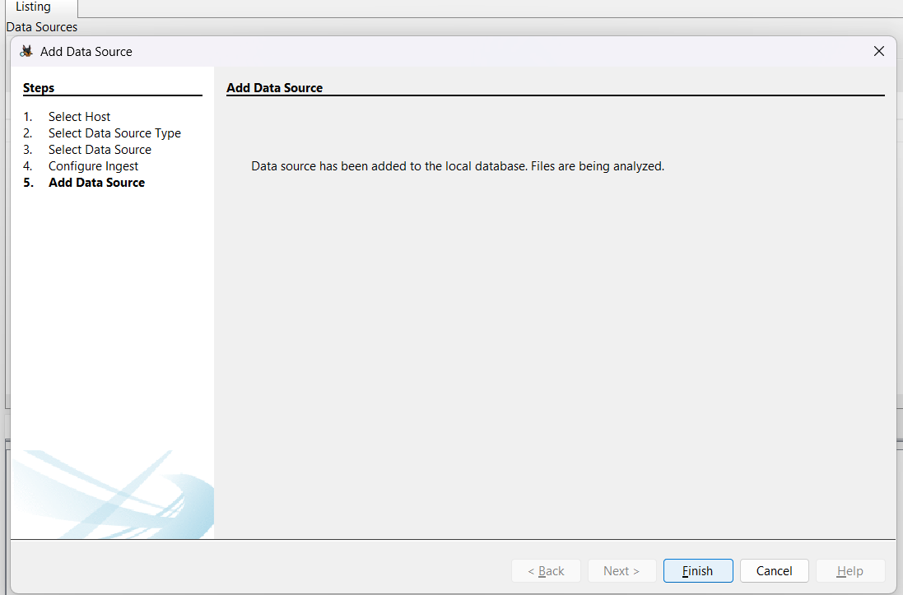

Tras completar la fase de procesamiento, el análisis forense se centra en la reconstrucción de la actividad del sospechoso mediante la inspección de archivos específicos recuperados del disco flexible.

**Identificación del Proveedor:** A través del archivo `Jimmy Jungle.doc`, se establece el vínculo directo con **Jimmy Jungle**, obteniendo su ubicación exacta en **626 Jungle Ave Apt 2, Jungle, NY 11111**.

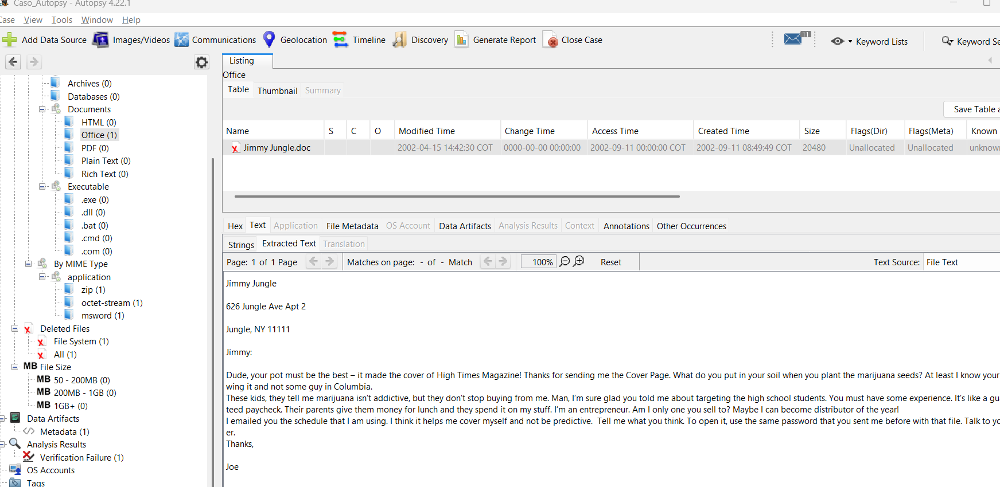

**Anomalía en la Imagen de Portada:** El análisis del archivo `coverpage.jpg` revela una inconsistencia crítica de almacenamiento. Aunque es una imagen, contiene rastros de datos ajenos en sus sectores finales (específicamente el texto `"Scheduled Visits.xls"`), lo que indica que fue utilizada para ocultar información o está vinculada a otros archivos del sistema.

#### 1. Identificación de la Incoherencia de Tamaño

Al examinar los metadatos del archivo (que aparece originalmente como `cover page.jpgc`), se observa que el sistema le asigna un tamaño de **15,585 bytes**. En un sistema de archivos FAT12, esto requeriría aproximadamente **31 sectores** (de 512 bytes cada uno). Sin embargo, el análisis forense revela que el archivo tiene asignados sectores adicionales, del **73 al 108** (un total de 36 sectores).

#### 2. Análisis de Cabeceras (Magic Bytes)

Para confirmar que es una imagen, se realiza una búsqueda de la firma **JFIF** (típica de archivos JPEG). En este caso, la firma se localiza correctamente en el **sector 73**, lo que confirma que el archivo comienza como una imagen legítima.

#### 3. Inspección de los Sectores Finales (Slack Space / Datos Concatenados)

La anomalía crucial se encuentra al inspeccionar los últimos sectores asignados a este archivo que exceden el tamaño real de la imagen:

- Al visualizar el contenido de estos sectores en modo **Hex** o **Strings** (Cadenas de texto) dentro de Autopsy, el analista debe dirigirse al final del bloque asignado.
- En el **sector 108**, se descubre el texto legible **`"Scheduled Visits.xls"`**.

#### 4. Conclusión Forense del Hallazgo

La presencia de este nombre de archivo (`Scheduled Visits.xls`) dentro de los sectores asignados a una imagen (`coverpage.jpg`) es una prueba clara de una **anomalía de almacenamiento**. Esto indica que el sospechoso utilizó este espacio para ocultar rastros de la hoja de cálculo logística o que el archivo fue manipulado para vincularlo con la agenda de distribución de sustancias.

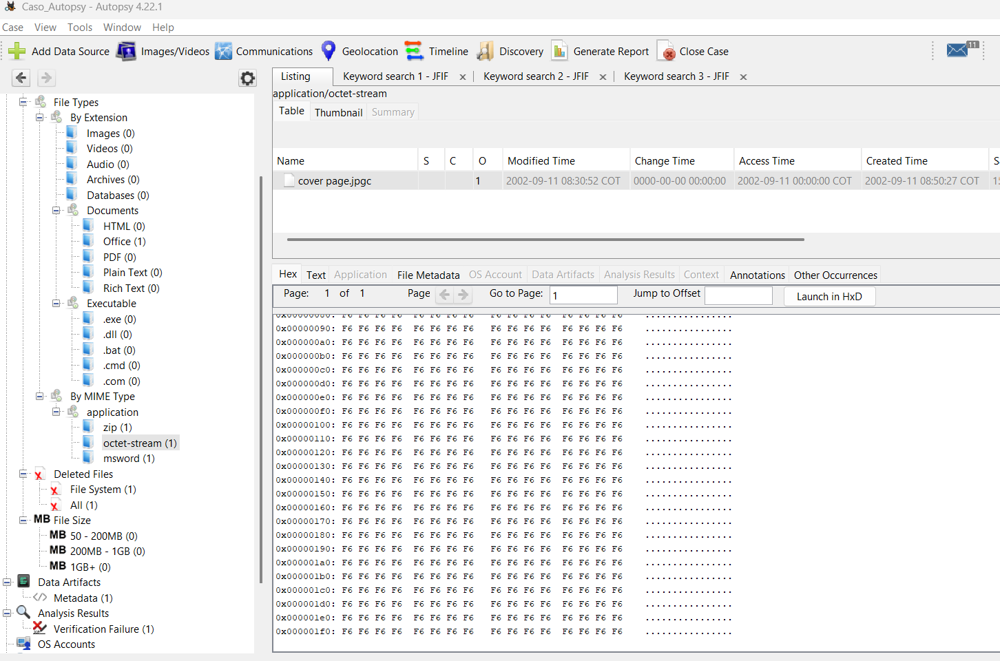

**Descubrimiento de la Agenda Oculta:** El archivo `Scheduled Visits.exe` es el hallazgo más relevante en cuanto a técnicas de ocultamiento. El análisis de firmas confirma que no es un ejecutable, sino un archivo comprimido que protege una hoja de cálculo.

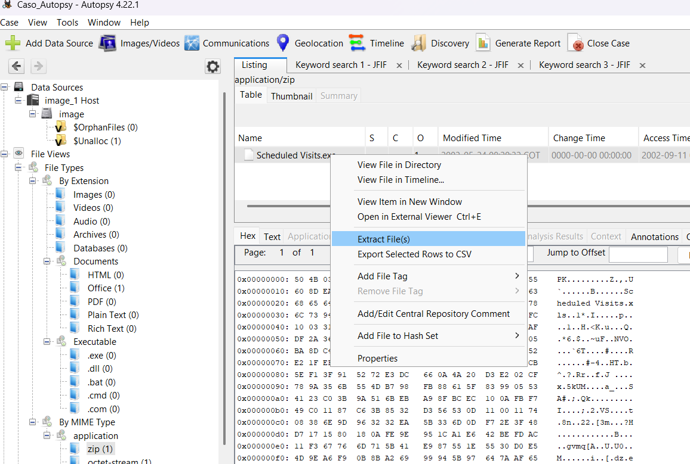

Se extrae el archivo y se modifica su extensión.

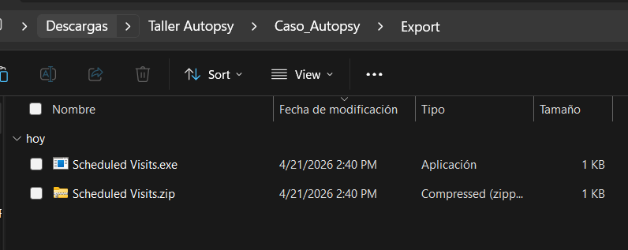

**Extracción de Datos Logísticos:** Utilizando la contraseña **`"goodtimes"`** (obtenida del intercambio de correspondencia), se logra acceder al archivo `Scheduled Visits.xls`, el cual detalla la red de distribución en diversas instituciones educativas como **Key, Leetch, Birard, Richter y Hull High School**.

Este análisis demuestra un esfuerzo deliberado por parte de Joe Jacobs para enmascarar su operación mediante el cambio de extensiones y el uso de contraseñas.

---

## RESPUESTAS A LAS PREGUNTAS

### 1. ¿Quién es el proveedor de marihuana de Joe Jacobs y cuál es la dirección listada del proveedor?

El proveedor ha sido identificado como **Jimmy Jungle**. Su ubicación, según los registros encontrados en la correspondencia técnica, es la siguiente:

- **Dirección:** 626 Jungle Ave Apt 2, Jungle, NY 11111.
- **Sustento:** Esta información se extrajo del archivo `Jimmy Jungle.doc`, que contiene una carta dirigida a Joe detallando la calidad del producto y la estrategia de venta.

### 2. ¿Qué dato crucial está disponible dentro de coverpage.jpg y por qué el dato es crucial?

- **Dato crucial:** En el **sector 108**, que forma parte de los sectores asignados a este archivo, se encontró la cadena de texto legible **`"Scheduled Visits.xls"`**.
- **Por qué es crucial:** Este hallazgo revela una **anomalía de almacenamiento**. El archivo `coverpage.jpg` (originalmente `cover page.jpgc`) tiene asignados 36 sectores (del 73 al 108), a pesar de que la imagen solo requiere 31 sectores para su tamaño lógico. La presencia del nombre de la hoja de cálculo en el último sector actúa como un "puntero" o rastro que vincula la imagen de portada con la agenda de distribución protegida del sospechoso.

### 3. ¿Qué (si hay) otras escuelas vecinas a Smith Hill Joe Jacobs frecuenta?

Además de **Smith Hill High School**, el análisis de la agenda logística revela que Joe Jacobs frecuenta las siguientes instituciones:

- Key High School
- Leetch High School
- Birard High School
- Richter High School
- Hull High School

**Sustento:** Estos nombres se obtuvieron tras extraer el archivo oculto `Scheduled Visits.xls` contenido dentro de `Scheduled Visits.exe` y abrirlo con la contraseña **`"goodtimes"`**.

### 4. Para cada archivo, ¿qué procesos hizo el sospechoso para enmascararlos de otros?

El sospechoso utilizó diversas técnicas de ofuscación y ocultamiento:

- **`cover page.jpgc`:** Alteró la extensión original del archivo (añadiendo una `'c'`) y utilizó el espacio final de los sectores asignados (slack space o concatenación) para ocultar rastros de otros archivos.
- **`Jimmy Jungle.doc`:** Intentó ocultar el archivo bajo un nombre que parece legítimo, aunque el contenido revela la operación ilícita.
- **`Scheduled Visits.exe`:** Utilizó una **extensión falsa**. A pesar de presentarse como un ejecutable, el archivo es en realidad un contenedor **ZIP** protegido.
- **Cifrado:** Protegió la hoja de cálculo interna con una contraseña (**`"goodtimes"`**) para evitar el acceso directo a la logística de distribución.

### 5. ¿Qué procesos realizó usted (como analista) para examinar el contenido completo de cada archivo?

Como analista, se siguieron los protocolos estándar de informática forense:

- **Verificación de Integridad:** Se validó el hash MD5 de la imagen original (`b676147f63923e1f428131d59b1d6a72`) para asegurar que la evidencia no fue alterada.
- **Análisis de Firmas (Magic Bytes):** Se inspeccionaron las cabeceras hexadecimales para identificar archivos con extensiones falsas, como el caso de `Scheduled Visits.exe` identificado como ZIP (`PK`).
- **Búsqueda de Palabras Clave (Keyword Search):** Se realizaron búsquedas de términos como `"JFIF"` para localizar imágenes y nombres de archivos ocultos en sectores específicos.
- **Análisis de Sectores y Metadatos:** Se comparó el tamaño lógico de los archivos con el espacio físico asignado en el disco para detectar datos ocultos en los sectores finales.
- **Extracción y Descompresión:** Se utilizaron herramientas como `dd` o la función "Extract" de Autopsy para recuperar archivos protegidos y acceder a su contenido mediante el uso de contraseñas recuperadas de la misma evidencia.

