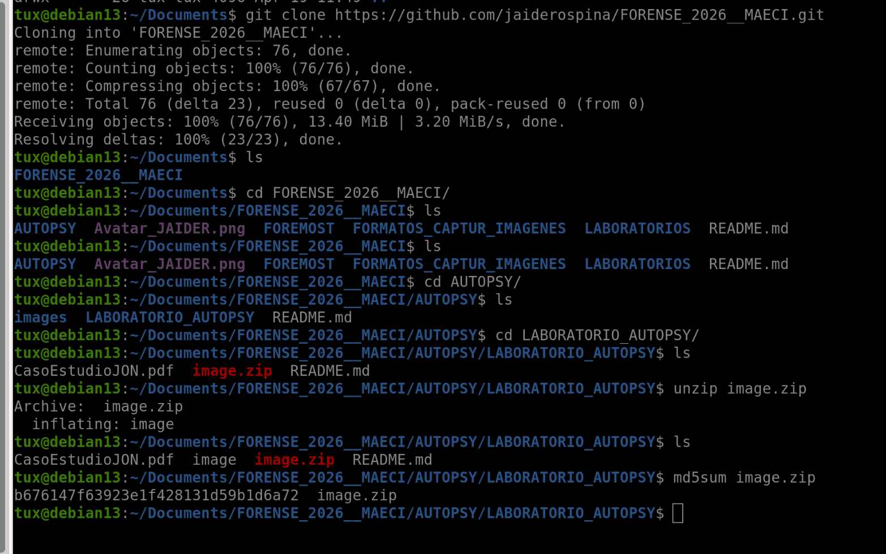

# Análisis Forense Digital con Autopsy

## Caso: Joe Jacobs - Distribución de Sustancias Ilícitas

Este repositorio documenta el desarrollo de un ejercicio práctico de análisis forense digital realizado con **Autopsy 4.23.0**. Durante el laboratorio se creó un caso forense, se incorporó una imagen de evidencia, se revisaron archivos eliminados y se complementó el análisis con comandos de terminal cuando las limitaciones de la herramienta impidieron avanzar únicamente desde la interfaz gráfica.

## Integrantes del grupo

- MY. Samir Salek
- MY. Cristian Meza
- MY. Jhon Colorado
- MY. Merly Rivera
- MY. Harrinton Calderón

## Contexto del caso

Joe Jacobs, de 28 años, fue arrestado bajo sospecha de distribución de marihuana a estudiantes de secundaria. La detención se produjo después de un operativo encubierto en el estacionamiento de **Smith Hill High School**, donde Jacobs ofreció marihuana a un agente que se hacía pasar por estudiante.

Durante el encuentro, Jacobs indicó que su proveedor cultivaba y vendía directamente la sustancia. Esta afirmación llevó a las autoridades a buscar evidencia digital que permitiera identificar al proveedor y determinar si Jacobs realizaba actividades similares en otras instituciones educativas.

Como parte del registro, la policía incautó una pequeña cantidad de marihuana y un **disquete**, del cual se generó una imagen forense. Esa imagen fue la evidencia principal analizada en este trabajo.

## Objetivos de la investigación

1. Identificar al proveedor de marihuana de Joe Jacobs y su dirección.
2. Analizar los archivos recuperados de la imagen forense.
3. Determinar si existía información sobre otras escuelas frecuentadas por el sospechoso.
4. Identificar técnicas de ocultamiento, eliminación o protección de archivos.
5. Documentar el procedimiento forense aplicado y las limitaciones encontradas en Autopsy 4.23.0.

## Herramientas utilizadas

- **Autopsy 4.23.0** para la creación del caso y el análisis de la evidencia.
- **Terminal de Linux** para ejecutar comandos de apoyo durante la extracción y validación de archivos.
- **md5sum** para verificar la integridad de la evidencia.
- **dd** para extraer manualmente fragmentos de la imagen cuando no fue posible hacerlo completamente desde Autopsy.
- **LibreOffice Calc** para abrir y revisar archivos recuperados.
- **ChatGPT** como apoyo para resolver errores, interpretar limitaciones de la versión 4.23 de Autopsy y proponer alternativas de extracción cuando algunos módulos o funciones no respondieron como se esperaba.

## Validación de la evidencia

Antes de iniciar el análisis en Autopsy se descomprimió el archivo entregado y se verificó la integridad de la evidencia mediante el cálculo del hash MD5.

Archivo analizado: `image.zip`

Hash MD5 obtenido:

```text
b676147f63923e1f428131d59b1d6a72
```

Esta validación permitió confirmar que se estaba trabajando sobre la evidencia correcta antes de incorporarla al caso forense.

Comandos utilizados para preparar y validar la evidencia:

```bash
unzip image.zip
md5sum image.zip
```



## Metodología de análisis

### 1. Creación del caso en Autopsy

La creación del caso se realizó desde el asistente de Autopsy, registrando la información básica de la investigación y el directorio donde se almacenarían los resultados.

**Paso 1.** Se creó un nuevo caso y se diligenció el nombre del caso, el directorio base y el tipo de caso.


**Paso 2.** Se completó la información opcional del caso, incluyendo los datos del examinador responsable del laboratorio.


**Paso 3.** Se inició el asistente para agregar una nueva fuente de datos y se definió el host que agruparía la evidencia.


**Paso 4.** Se seleccionó como tipo de fuente una imagen de disco o archivo de máquina virtual.


**Paso 5.** Se indicó la ruta de la imagen a analizar, la zona horaria y el hash MD5 obtenido previamente.


**Paso 6.** Se revisaron los módulos de ingestión disponibles para ejecutar el análisis automático sobre la fuente de datos.


**Paso 7.** Finalizado el asistente, la imagen quedó cargada dentro del caso y disponible para la exploración forense.


### 2. Carga de la fuente de datos

Durante la carga de la imagen, Autopsy reportó módulos no compatibles con el entorno utilizado. Para evitar conflictos, los módulos que presentaban incompatibilidad no fueron seleccionados y se continuó el análisis con los componentes funcionales.


**Nota:** esta decisión permitió continuar el proceso sin detener el laboratorio, aunque algunas funciones de Autopsy 4.23.0 quedaron limitadas y tuvieron que ser complementadas desde la terminal.

### 3. Exploración del sistema de archivos

Con la imagen cargada, se revisó la estructura del sistema de archivos, los archivos asignados, los archivos eliminados, el espacio no asignado y la clasificación por tipos de archivo. A partir de esta revisión se identificaron tres evidencias principales: una imagen, un documento y un archivo protegido.


## Hallazgos forenses

### Archivos eliminados recuperados

Autopsy permitió identificar archivos eliminados dentro de la imagen forense. Esta condición es relevante porque indica un posible intento de ocultamiento o eliminación de información sensible. Los archivos más importantes para el caso fueron:

- `cover page.jpgc`
- `Jimmy Jungle.doc`
- `Scheduled Visits.exe`

### Archivo `cover page.jpgc`

Este archivo fue uno de los primeros elementos de interés detectados. Su revisión inicial en Autopsy mostró una vista hexadecimal y metadatos básicos, como nombre, tamaño, estado de asignación y fechas asociadas.


En el caso guía, este archivo corresponde a una imagen que contiene una pista clave relacionada con la contraseña del archivo protegido. Sin embargo, durante nuestro análisis no fue posible identificar de forma completa la información necesaria en los metadatos para trabajar directamente con la función **Jump to Offset** o con segmentos desde la interfaz de Autopsy.

Por esta limitación, se recurrió a la terminal para extraer manualmente el contenido mediante comandos como `dd`, reconstruir la imagen y visualizarla fuera de Autopsy.

Comandos utilizados para extraer y reconstruir la imagen:

```bash
dd if=image bs=512 skip=73 count=36 of=coverpage.raw
file coverpage.raw
mv coverpage.raw coverpage.jpg
open coverpage.jpg
```


Este procedimiento permitió confirmar que el archivo contenía una imagen relacionada con el caso, aun cuando la recuperación no pudo realizarse completamente desde Autopsy.

### Archivo `Jimmy Jungle.doc`

Se identificó un documento con contenido textual legible dentro de Autopsy. El documento contiene una comunicación dirigida a Jimmy Jungle y permite extraer información importante para responder el cuestionario del caso.


Del contenido del documento se identificaron datos relevantes del proveedor:

- **Nombre:** Jimmy Jungle
- **Dirección:** 626 Jungle Ave, Apt 2, Jungle, NY 11111

También se observó una referencia a un archivo con horarios y a una contraseña utilizada previamente, lo que permitió relacionar este documento con las demás evidencias recuperadas.

### Archivo `Scheduled Visits.exe`

Otro hallazgo importante fue el archivo `Scheduled Visits.exe`. Aunque su extensión sugería que se trataba de un ejecutable, la revisión en Autopsy permitió identificar indicios de que el contenido real correspondía a un archivo comprimido.

Primero se revisó el archivo desde las vistas hexadecimal, cadenas de texto y metadatos.


Al intentar abrirlo directamente se presentó un error, lo que confirmó que el archivo requería tratamiento adicional antes de poder ser consultado.


Para recuperar el contenido, se utilizaron comandos en la terminal con el fin de extraer el segmento correcto de la imagen, renombrar el archivo y probar su apertura con el formato adecuado.

Comandos utilizados para recuperar y abrir el archivo protegido:

```bash
dd if=image bs=512 skip=104 count=53 of=visits.raw
file visits.raw
mv visits.raw visits.zip
open visits.zip
```


Después de recuperar el archivo, el sistema solicitó una contraseña para descomprimirlo.


En este punto se utilizó la contraseña indicada en el caso de ejemplo, `goodtimes`, debido a que en nuestra ejecución no fue posible encontrar la pista completa dentro de los metadatos del archivo `cover page.jpgc` por las limitaciones observadas en Autopsy 4.23.0.

Finalmente, al ingresar la contraseña correcta, fue posible abrir el archivo y visualizar una hoja de cálculo con visitas programadas a diferentes instituciones educativas.


## Técnicas de ocultamiento identificadas

Durante el análisis se observaron varias acciones orientadas a dificultar el acceso a la información:

- Eliminación de archivos dentro del medio analizado.
- Uso de extensiones engañosas, como el archivo `Scheduled Visits.exe`, cuyo contenido real correspondía a un archivo comprimido.
- Protección de información mediante contraseña.
- Fragmentación de la evidencia, ya que la información necesaria para abrir un archivo protegido se encontraba relacionada con otro archivo.
- Uso de archivos aparentemente comunes, como imágenes o documentos, para almacenar información relevante.

## Procedimientos forenses aplicados

1. Verificación de integridad de la evidencia mediante hash MD5.
2. Creación del caso en Autopsy.
3. Carga de la imagen forense como fuente de datos.
4. Configuración de módulos de ingestión compatibles.
5. Exploración del sistema de archivos y archivos eliminados.
6. Revisión de metadatos.
7. Análisis hexadecimal y revisión de cadenas.
8. Extracción manual de archivos mediante terminal.
9. Apertura de archivos recuperados y protegidos.
10. Correlación de información entre evidencias.

## Resultados de la investigación

### 1. Proveedor identificado

El proveedor identificado en el documento recuperado fue:

- **Nombre:** Jimmy Jungle
- **Dirección:** 626 Jungle Ave, Apt 2, Jungle, NY 11111

### 2. Contraseña utilizada para acceder al archivo protegido

La contraseña usada para abrir el archivo recuperado fue:

```text
goodtimes
```

En el caso guía, esta contraseña se encuentra asociada a la imagen recuperada. En nuestro análisis fue necesario apoyarse en el caso de ejemplo, porque la versión de Autopsy utilizada no permitió obtener la pista completa desde los metadatos del primer archivo.

### 3. Escuelas identificadas

La hoja de cálculo recuperada permitió identificar instituciones relacionadas con las visitas programadas:

- Birard High School
- Hull High School
- Key High School
- Leetch High School
- Richter High School
- Smith Hill High School

### 4. Evidencia de ocultamiento

El caso muestra que la información relevante no estaba almacenada de forma directa, sino distribuida entre documentos, imágenes y archivos comprimidos protegidos. Esto evidencia un intento de dificultar el acceso a la información y de ocultar la relación entre el proveedor, el sospechoso y las visitas a diferentes escuelas.

## Hallazgos principales

- Se validó la evidencia mediante MD5 antes de iniciar el análisis.
- Se creó y configuró correctamente un caso forense en Autopsy.
- Se identificaron archivos eliminados relevantes para la investigación.
- Se recuperó información del archivo `cover page.jpgc` mediante apoyo de terminal.
- Se analizó el documento `Jimmy Jungle.doc`, que permitió identificar al proveedor y su dirección.
- Se recuperó y abrió el archivo protegido asociado a `Scheduled Visits.exe`.
- Se identificaron varias escuelas relacionadas con las visitas programadas.
- Se documentaron limitaciones reales de Autopsy 4.23.0 y la forma en que fueron superadas.

## Conclusión

El análisis forense permitió establecer que la imagen incautada contenía evidencia relevante para la investigación contra Joe Jacobs. A partir del documento recuperado se identificó al proveedor como **Jimmy Jungle**, junto con su dirección. También se recuperó un archivo protegido que contenía información sobre visitas a múltiples instituciones educativas, lo que permite concluir que la actividad investigada no se limitaba únicamente a Smith Hill High School.

El caso evidencia el uso de técnicas básicas de ocultamiento digital, como eliminación de archivos, uso de extensiones engañosas y protección mediante contraseña. Aunque Autopsy 4.23.0 presentó limitaciones durante el análisis, estas fueron superadas con apoyo de comandos de terminal y documentación complementaria, permitiendo reconstruir la evidencia y responder los objetivos de la investigación.

### Limitaciones de Autopsy 4.23.0 y soluciones aplicadas

Durante el desarrollo del laboratorio se evidenciaron algunas limitaciones en la versión utilizada de Autopsy. Para no detener el análisis, se complementó el trabajo con comandos ejecutados desde la terminal.

| Limitación evidenciada en Autopsy 4.23.0 | Impacto en el análisis | Solución aplicada mediante terminal |
| --- | --- | --- |
| Algunos módulos de ingestión no eran compatibles con el entorno utilizado. | El análisis automático no podía ejecutarse con todos los módulos disponibles. | Se desmarcaron los módulos incompatibles y se continuó con los módulos funcionales para evitar conflictos. |
| No fue posible obtener desde Autopsy toda la información necesaria para trabajar con **Jump to Offset** o con segmentos del archivo `cover page.jpgc`. | La extracción de la imagen no pudo completarse directamente desde la interfaz gráfica. | Se usó `dd` para extraer manualmente el fragmento correspondiente desde la imagen forense y reconstruir el archivo. |
| El archivo `Scheduled Visits.exe` no abrió correctamente desde la interfaz gráfica. | No era posible consultar el contenido del archivo recuperado de forma directa. | Se extrajo el segmento con `dd`, se validó el tipo real del archivo con `file` y se renombró para tratarlo como archivo comprimido. |
| La extensión `.exe` no correspondía al contenido real del archivo. | Podía interpretarse erróneamente como un ejecutable, cuando en realidad contenía información comprimida. | Se revisó el encabezado hexadecimal y se comprobó el tipo de archivo desde la terminal antes de renombrarlo. |
| La contraseña del archivo protegido no pudo confirmarse completamente desde los metadatos del primer archivo en nuestra ejecución. | No era posible descomprimir el archivo protegido únicamente con la información recuperada desde Autopsy. | Se utilizó la contraseña del caso guía, `goodtimes`, y se documentó la limitación encontrada durante el análisis. |

## Estructura del repositorio

```text
.
├── README.md
└── fotos/
```
