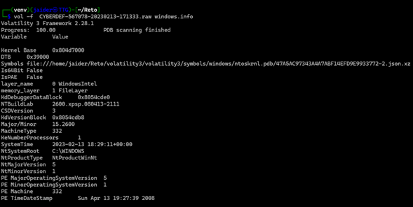
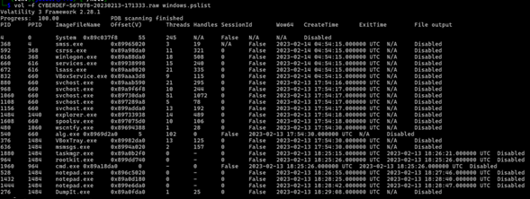

Este manual técnico y metodológico está diseñado específicamente para estructurar, ampliar y detallar las fases del análisis forense de memoria RAM basándose en el caso de estudio de la infección por **BlackEnergy v2** en infraestructura crítica (Reto CyberDefenders: BlackEnergy).

El objetivo es proporcionar un marco conceptual avanzado junto con la aplicación práctica y justificada de los comandos bajo **Volatility 3**.

---

# Análisis Forense de Memoria RAM

## Caso de Estudio: Respuesta a Incidentes frente a BlackEnergy v2

### 1. Contextualización del Vector de Amenaza: BlackEnergy v2

BlackEnergy evolucionó de ser un kit de herramientas para ataques distribuidos de denegación de servicio (DDoS) en 2007 a una sofisticada plataforma de ciberespionaje y sabotaje en su versión v2. Es un referente en la ciberseguridad de Tecnologías Operacionales (OT) e Infraestructuras Críticas, debido a su arquitectura modular basada en *plugins*, la capacidad de desplegar *rootkits* a nivel de kernel y su rol histórico como precursor de los ataques destructivos contra la red eléctrica (como el apagón de Ucrania en 2015).

El análisis de memoria RAM (*Live Memory Forensics*) en este escenario es vital: BlackEnergy v2 utiliza técnicas de ocultamiento, inyección de código y controladores en modo kernel que evaden por completo las auditorías forenses tradicionales basadas en el almacenamiento en disco.

---

### 2. Fase de Triaje e Identificación del Entorno (`windows.info`)

Antes de realizar búsquedas puntuales, es mandatorio extraer los metadatos estructurales del volcado para entender las reglas de direccionamiento de la muestra.

* **Comando:**

```bash
vol -f CYBERDEF-567078-20230213-171333.raw windows.info

```




#### Ampliación Conceptual y Justificación:

A diferencia de las versiones heredadas de la herramienta (donde se obligaba al analista a usar `imageinfo` y predefinir un perfil estático como `--profile=Win7SP1x64`), Volatility 3 utiliza la capa de abstracción de traducción de memoria del archivo original. Interroga la estructura `_KDDEBUGGER_DATA64` (KDBG) para determinar dinámicamente el sistema operativo, la arquitectura y los mapas de símbolos (PDB) necesarios.

#### Datos clave que se extraen y su utilidad forense:

* **Arquitectura (32 vs 64 bits):** Define el tamaño de las estructuras del kernel en la memoria (punteros de 4 u 8 bytes).
* **NTBuildLab (Build del Kernel):** Muestra la versión e historial exacto del parcheado de Windows. Esto permite correlacionar si el sistema era vulnerable a exploits de elevación de privilegios locales utilizados frecuentemente por BlackEnergy para saltar de espacio de usuario (*User Mode*) a espacio de kernel (*Kernel Mode*).
* **SystemTime:** Establece la hora exacta en la que se congeló la memoria RAM. Toda la línea de tiempo del ataque (*Timeline*) se calcula de forma relativa a este valor.

---

### 3. Fase de Enumeración Lógica y Descubrimiento de Anomalías (`windows.pslist`)

La primera línea de visibilidad consiste en listar las estructuras de procesos que el sistema operativo reconoce formalmente.

* **Comando:**
```bash
vol -f CYBERDEF-567078-20230213-171333.raw windows.pslist

```





Al analizar la salida del comando `windows.pslist`, se identifican varias anomalías y procesos altamente sospechosos basados en la jerarquía de procesos (PID/PPID), el comportamiento temporal y los nombres de las imágenes.

A continuación se detallan los hallazgos estructurados por nivel de criticidad:

---

## 1. Hallazgos de Alta Criticidad (Amenaza Confirmada)

### `rootkit.exe` (PID: 964 | PPID: 1484)

* **Anomalía:** El nombre del archivo es un indicador directo de compromiso (IOC). Aunque los atacantes suelen camuflar sus herramientas, en este caso el binario lleva explícitamente el nombre de una tipología de malware.
* **Comportamiento:** Fue ejecutado por el usuario a través de `explorer.exe` (PPID 1484).
* **Línea de tiempo:** Se creó a las `18:25:26` y finalizó en ese mismo segundo. Esto sugiere que se trató de un instalador, un script automatizado o un ejecutable que desplegó una carga útil en el sistema antes de cerrarse.

### `cmd.exe` (PID: 1960 | PPID: 964)

* **Anomalía de Parentesco:** Este proceso de consola fue generado directamente por `rootkit.exe` (PPID 964) a las `18:25:26`.
* **Evidencia de Ejecución:** Al igual que su proceso padre, se abrió y se cerró de manera inmediata. Esto es típico de la ejecución de comandos en segundo plano (*spawning*) para realizar modificaciones en el sistema, persistencia o evasión.

---

## 2. Hallazgos de Criticidad Media (Comportamiento Inusual)

### Actividad Anómala de `notepad.exe`

Se observa una ráfaga de ejecuciones de blocs de notas en un lapso de menos de dos minutos, todos con tiempos de vida extremadamente cortos:

* **PID 528:** Duró 51 segundos (`18:26:55` a `18:27:46`).
* **PID 1432:** Duró 15 segundos (`18:28:25` a `18:28:40`).
* **PID 1444:** Duró 5 segundos (`18:28:42` a `18:28:47`).
* **Análisis Forense:** Que un usuario abra y cierre de forma interactiva tres instancias de Notepad con diferencias de segundos es poco probable. Este patrón suele indicar técnicas de **Process Injection** (como *Process Hollowing*), donde el malware levanta procesos legítimos del sistema en estado suspendido para inyectar código malicioso en su espacio de memoria y luego finalizarlos tras cumplir su objetivo.

---

## 3. Procesos Técnicos Explicables (Línea Base Forense)

* **`DumpIt.exe` (PID: 276 | PPID: 1484):** Es la herramienta legítima utilizada para realizar el volcado de la memoria RAM. Su ejecución (`18:29:08`) explica el fin de la línea de tiempo de la actividad en esta máquina, permaneciendo activo (*N/A* en *ExitTime*) al momento de congelar la memoria.
* **`explorer.exe` (PID: 1484 | PPID: 1440):** El proceso padre (PPID 1440) no aparece listado, lo cual es normal en entornos Windows antiguos (como Windows XP o Windows 7 de arquitectura x86, deducible por el formato de las direcciones virtuales `0x89...`), donde el proceso creador de la interfaz gráfica (`userinit.exe`) se autotermina tras iniciar el escritorio.

---

## Resumen de la Línea de Tiempo del Incidente (2023-02-13)

1. **18:25:15** – El usuario abre el Administrador de Tareas (`taskmgr.exe`), posiblemente al notar lentitud o comportamiento extraño.
2. **18:25:26** – Se ejecuta el binario malicioso `rootkit.exe`, el cual despliega instantáneamente una consola `cmd.exe` para realizar acciones ocultas.
3. **18:26:55 a 18:28:47** – Se genera la secuencia inusual de procesos `notepad.exe`, lo que apunta fuertemente a una fase de inyección de código o persistencia.
4. **18:29:08** – Se ejecuta `DumpIt.exe` para capturar la evidencia forense.

### Siguientes pasos recomendados en el análisis:

Para confirmar la inyección en los procesos de Notepad y extraer los comandos ejecutados por el Rootkit, se sugiere correr los siguientes módulos complementarios en Volatility:

* `windows.cmdline` (para ver los argumentos exactos con los que se ejecutaron las consolas y blocs de notas).
* `windows.malfind` (para detectar código inyectado u oculto en las regiones de memoria de los procesos finalizados o sospechosos).


---
#### Ampliación Conceptual y Justificación:

Este plugin recorre la lista doblemente enlazada apuntada por el miembro `ActiveProcessLinks` dentro de la estructura `_EPROCESS` de cada proceso en el kernel de Windows.

#### Hallazgos Críticos en el Escenario BlackEnergy v2:

Al evaluar la salida en este reto específico, se identifican binarios con comportamientos anómalos, tales como:

* `rootkit.exe`
* `cmd.exe`

Al inspeccionar los metadatos de estos procesos en la tabla generada, se observa un detalle técnico alarmante: **poseen 0 hilos (Threads) activos**. En la ingeniería de Windows, un proceso con cero hilos significa que su ejecución principal ha concluido y está en estado "terminado" o latente. Sin embargo, su estructura `_EPROCESS` aún no ha sido purgada por el administrador de memoria debido a que algún objeto o componente (como un controlador malicioso o un *handle* abierto) mantiene una referencia hacia él.

La presencia de un binario con el nombre explícito `rootkit.exe` que interactúa con la consola (`cmd.exe`) y luego finaliza su ejecución, suele indicar la fase de instalación y despliegue del componente persistente de BlackEnergy.

---

### 4. Técnicas Avanzadas de Ocultamiento y Detección en la RAM

Para un análisis forense de alta fidelidad, la inspección de procesos no debe detenerse en la lista oficial. Los atacantes avanzados alteran las estructuras internas para engañar a las herramientas del sistema.

#### 4.1 Desenmascarando Procesos Ocultos (`windows.pssscan` y `windows.pstree`)

Los *rootkits* modernos y las variantes sofisticadas de BlackEnergy modifican los punteros de la lista `ActiveProcessLinks` (técnica conocida como **DKOM** o *Direct Kernel Object Manipulation*). Al desconectar el proceso de la lista doblemente enlazada, comandos como `pslist` o el Administrador de Tareas de Windows dejan de verlo.

* **Comando para escaneo por firmas en bruto:**
```bash
vol -f CYBERDEF-567078-20230213-171333.raw windows.psscan

```


* **Explicación:** Este plugin ignora las listas lógicas del sistema operativo y realiza un escaneo de fuerza bruta por toda la imagen física de la memoria RAM buscando las firmas específicas del encabezado de las estructuras `_EPROCESS` (la firma `Pool Tag` conocida como *Procs*). Al comparar la salida de `pslist` contra `psscan`, si un PID aparece en `psscan` pero no en `pslist`, se confirma la presencia de un proceso oculto por ingeniería maliciosa.


* **Comando para el análisis de relaciones de parentesco:**
```bash
vol -f CYBERDEF-567078-20230213-171333.raw windows.pstree

```


* **Explicación:** Organiza los procesos de forma jerárquica basándose en la relación `PID -> PPID` (Proceso Padre). Permite identificar anomalías visuales inmediatas, como un proceso del sistema legítimo (ej. `lsass.exe` o `svchost.exe`) habiendo sido engendrado por un proceso no confiable o huérfano.


#### 4.2 Localización de Código Inyectado en Memoria (`windows.malfind`)

Una de las firmas de identidad de BlackEnergy v2 es la inyección de librerías dinámicas (DLL Injection) y la ejecución de *shellcodes* directamente en los espacios virtuales de procesos de confianza (como `svchost.exe`).

* **Comando:**
```bash
vol -f CYBERDEF-567078-20230213-171333.raw windows.malfind

```


#### Ampliación Conceptual y Justificación:

Este plugin barre las regiones de memoria virtual de cada proceso inspeccionando los descriptores de direcciones virtuales o **VAD** (*Virtual Address Descriptors*). Busca específicamente regiones de memoria que cumplan con dos condiciones sospechosas simultáneas:

1. Tener características de protección **`PAGE_EXECUTE_READWRITE` (EXECUTE_READWRITE)**. Las políticas de mitigación de exploits modernas dictan que la memoria debe ser de escritura o de ejecución, pero casi nunca ambas al tiempo (W^X o *Write XOR Execute*).
2. Que la región de memoria no esté respaldada por un archivo mapeado en el disco duro (conocida como memoria privada o de asignación anónima).

Cuando `malfind` reporta un hallazgo, muestra los primeros bytes en formato hexadecimal y desensamblado (*Disassembly*). Si se observa la firma mágica `MZ` (los bytes `4D 5A`) en el inicio de una sección de memoria privada inyectada dentro de un proceso del sistema, se ha descubierto la carga útil (*payload*) o la DLL oculta de BlackEnergy v2 operando de forma exclusivamente residente en memoria.

---

### 5. Guía de Referencia y Buenas Prácticas Forenses

Para asegurar el control de calidad, la repetibilidad y el valor probatorio de la investigación, el analista debe aplicar estrictamente las siguientes directrices metodológicas:

1. **Garantía de Integridad (Haseado):** Antes de interactuar con el archivo de la memoria (en este caso el archivo con extensión `.raw`), se debe calcular su firma hash criptográfica ($SHA-256$). El análisis se debe ejecutar siempre sobre una réplica exacta de trabajo, jamás sobre la evidencia original.
2. **Aislamiento de Red y Repositorio de Símbolos:** Volatility 3 requiere conectarse a los servidores oficiales de Microsoft para descargar los archivos de símbolos que traducen las direcciones lógicas. Si el análisis se realiza dentro de una zona segura o sandbox aislada de internet (*Air-Gapped*), los archivos JSON de los símbolos deben precargarse manualmente en el directorio de la herramienta para evitar fallos de lectura en los plugins.
3. **Persistencia en Kernel (Módulos):** En el caso de sospecha fuerte de BlackEnergy v2 (debido al hallazgo de procesos terminados con hilos en cero), se recomienda complementar la investigación con el plugin `windows.modules` y `windows.driverscan`. Esto permitirá auditar la lista de controladores cargados en el espacio del kernel para interceptar componentes de tipo *rootkit* que intercepten llamadas al sistema (*SSDT hooking*).


---

# HANDLE.
En las ciencias de la computación, un handle es un patrón de diseño general para el manejo de recursos.En las ciencias de la computación, un handle es un patrón de diseño general para el manejo de recursos.
En la arquitectura de sistemas operativos Windows, un **handle** (traducido técnicamente como *manejador* o *antena*) es una referencia abstracta o un testigo numérico que utiliza un proceso para interactuar con los recursos del kernel.

Cuando un proceso en espacio de usuario (*User Mode*) necesita acceder a un recurso gestionado por el sistema operativo, no puede manipularlo de forma directa por razones de seguridad y estabilidad. En su lugar, el kernel le otorga un "token" o identificador único (el *handle*) para que pueda realizar operaciones autorizadas sobre dicho recurso.

En sistemas basados en Unix, como Linux y macOS, se aplica la filosofía fundamental de que "todo es un archivo" (los procesos, los sockets de red, los discos y los periféricos se tratan como flujos de bytes).
El equivalente exacto a un handle de Windows en estos entornos es el File Descriptor (FD) o Descriptor de Archivo.


**El concepto de *handle* no es exclusivo de Windows.** Aunque Microsoft popularizó el término y lo integró de forma explícita en su API de desarrollo (Win32), casi todos los sistemas operativos modernos (incluyendo Linux, macOS, Unix y sistemas de tiempo real) utilizan exactamente el mismo principio arquitectónico bajo diferentes nombres técnicos.

---

## El Equivalente en Linux / Unix: El Descriptor de Archivo (*File Descriptor*)

En sistemas basados en Unix, como Linux y macOS, se aplica la filosofía fundamental de que *"todo es un archivo"* (los procesos, los sockets de red, los discos y los periféricos se tratan como flujos de bytes).

El equivalente exacto a un *handle* de Windows en estos entornos es el **File Descriptor (FD)** o *Descriptor de Archivo*.

### ¿Cómo opera en Linux?

1. Cuando un programa solicita abrir un recurso (por ejemplo, una conexión de red o un archivo), el kernel de Linux crea una estructura interna.
2. El sistema devuelve un **número entero no negativo** (0, 1, 2, 3...).
3. Ese número es el índice en la tabla privada de descriptores de archivos del proceso. El proceso no conoce la ubicación física en la memoria del recurso; solo sabe que el entero `3` representa a su archivo abierto.

---

## Comparativa Arquitectónica: Windows vs. Linux

| Característica | Windows (`Handle`) | Linux / Unix (`File Descriptor`) |
| --- | --- | --- |
| **Tipo de Dato** | Tipo opaco (`HANDLE`, puntero void encubierto). | Número entero indexado (`int`). |
| **Filosofía del Sistema** | Basado en Objetos del Kernel diferenciados (Procesos, Mutex, Semáforos, Archivos). | *"Todo es un archivo"* (Casi cualquier recurso se mapea como un descriptor de archivo). |
| **Visibilidad estándar** | Visibles globalmente en auditorías mediante herramientas como *Sysinternals Handle* o plugins como `windows.handles`. | Visibles de forma nativa en el sistema de archivos virtual examinando la ruta `/proc/[PID]/fd/`. |

---

## ¿Por qué todos los Sistemas Operativos usan este diseño?

Independientemente de si se llama *Handle* o *Descriptor*, este mecanismo de "antena" o intermediario se implementa por tres razones críticas de ingeniería de software:

* **Seguridad y Aislamiento:** Evita que un programa malicioso o mal programado modifique directamente la memoria del kernel ($Kernel\ Space$). Si los procesos tuvieran los punteros reales de los recursos, podrían corromper el sistema operativo.
* **Abstracción:** Al programador no le importa cómo gestiona el hardware un disco duro o una tarjeta de red; el sistema operativo solo le entrega un testigo (el *handle*) y el programador interactúa con él mediante funciones estándar.
* **Gestión de Memoria y Recolección:** Si el sistema operativo necesita mover el objeto del recurso a otra posición de la memoria RAM para optimizar el espacio, puede hacerlo sin romper el programa del usuario. El kernel simplemente actualiza su tabla interna; para el programa, el número de *handle* sigue siendo exactamente el mismo.

---

### ¿Cómo funciona un Handle?

Para entender su funcionamiento, se puede visualizar la tabla de manejadores que posee cada proceso activo en el sistema:

1. **Solicitud de Recurso:** Un proceso solicita abrir un archivo, un hilo o una sección de memoria mediante una llamada al sistema (*System Call*).
2. **Validación del Kernel:** El kernel valida que el proceso tenga los permisos de seguridad adecuados.
3. **Indexación en la Tabla:** Si la solicitud es aprobada, el kernel crea o localiza el objeto del recurso, registra un puntero hacia él en la tabla privada de *handles* del proceso y le devuelve al proceso un número entero (el índice de esa tabla).
4. **Manipulación Segura:** A partir de ese momento, cada vez que el proceso quiera leer o escribir en ese recurso, simplemente le dice al kernel: *"Realiza esta acción en mi handle número X"*.

---

### Tipos de Recursos Gestionados por Handles

La columna **Handles** que se observa en los reportes de comandos como `windows.pslist` en Volatility refleja la cantidad total de estos elementos que el proceso mantiene abiertos simultáneamente. Dichos elementos apuntan a diversos tipos de objetos:

* **Archivos y Directorios (`File`):** Soportes lógicos en el almacenamiento de disco o tuberías de comunicación (*Named Pipes*).
* **Llaves del Registro (`Key`):** Punteros a configuraciones específicas dentro de las colmenas del Registro de Windows.
* **Procesos e Hilos (`Process`, `Thread`):** Referencias mutuas para monitorear, suspender o inyectar código en otras tareas concurrentes.
* **Mutadores y Semáforos (`Mutant`, `Semaphore`):** Objetos de sincronización que evitan que dos procesos colisionen al intentar acceder a un mismo recurso crítico.

---

### Relevancia en la Investigación Forense y Detección de Anomalías

En el análisis forense de la memoria RAM, la monitorización de la cantidad y el tipo de *handles* proporciona un alto valor probatorio:

* **Fugas de Recursos (*Handle Leaks*):** Un proceso legítimo que presenta un incremento desmedido e ininterrumpido en su cuenta de *handles* puede estar sufriendo un error de programación o estar siendo explotado de forma anómala (por ejemplo, abriendo conexiones o archivos sin cerrar las referencias).
* **Detección de Persistencia y Mutex:** Muchos códigos maliciosos (como variantes de *BlackEnergy*) crean un *handle* de tipo `Mutant` con un nombre único y estático en el sistema. Esto lo hacen como un mecanismo de control de infecciones para verificar si la máquina ya se encuentra comprometida y evitar autoduplicarse, dejando un indicador de compromiso (IoC) evidente en la memoria.
* **Análisis de Acceso Ilícito:** Al inspeccionar en detalle la tabla de manejadores de un proceso sospechoso mediante plugins específicos (como `windows.handles`), el analista puede identificar con precisión exacta qué archivos específicos del sistema estaba modificando el atacante o qué llaves del registro de persistencia intentaba alterar.
  


---

# TALLER EN CLASE.


Replicar el ejercicio anterior el cual se baso en el sitio  https://medium.com/@damherrera06/an%C3%A1lisis-de-malware-blackenergy-v2-volcado-de-memoria-19bd91379d0b  ;  mejorar y ampliar las tecnicas y comando empleados.

**Evidencia**
- Link a la imágen de la memoria del caso  https://cyberdefenders.org/blueteam-ctf-challenges/blackenergy/

- **Crear un REDAME.md en carpetas con el nombre del grupo**


# Referencias.

- https://medium.com/@damherrera06/an%C3%A1lisis-de-malware-blackenergy-v2-volcado-de-memoria-19bd91379d0b
- https://www.foo.be/cours/dess-20122013/memdump/?C=S;O=A

---

# Taller individual.


Realizar el taller dearrollado en https://n1ght-w0lf.github.io/ctf%20writeups/memlabs-lab1/  el cua'l consiste en:

La resolución de un desafío de análisis forense de memoria digital (Memory Forensics) llamado **MemLabs - Lab1**, creado con fines educativos. El objetivo principal es analizar la captura de la memoria RAM de una computadora que falló (`MemoryDump_Lab1.raw`) utilizando la herramienta **Volatility** para extraer tres "banderas" o *flags* ocultas.

El ejercicio se divide en la obtención de estas tres etapas:

### 1. Primera Bandera (Stage 1)

* **Análisis:** El autor comienza identificando el sistema operativo del volcado de memoria (el cual resulta ser Windows 7 SP1 x64) y revisa la lista de procesos activos en ese momento.
* **Hallazgo:** Detecta que el proceso de la consola de comandos (`cmd.exe`) estuvo en ejecución. Al examinar el historial de comandos ejecutados, descubre que se corrió un comando llamado `St4G3$1` que dejó un texto codificado en **Base64**.
* **Solución:** Al decodificar el texto, obtiene la primera bandera: `flag{th1s_1s_th3_1st_st4g3!!}`.

### 2. Segunda Bandera (Stage 2)

* **Análisis:** El enunciado del reto mencionaba que la víctima "estaba intentando dibujar algo" antes de que el sistema colapsara. Al inspeccionar los procesos, el autor nota que `mspaint.exe` (Microsoft Paint) estaba abierto.
* **Hallazgo:** El autor extrae directamente el volcado de memoria específico de ese proceso (`memdump`) y cambia su extensión a un formato de datos gráficos crudos (`.data`).
* **Solución:** Abre este archivo volcado usando el editor de imágenes **GIMP**, ajusta el ancho, el alto y el desplazamiento de los píxeles (*offset*) hasta reconstruir visualmente la imagen que estaba en la pantalla de Paint, revelando la segunda bandera: `flag{G00d_Boy_good_girL}`.

### 3. Tercera Bandera (Stage 3)

* **Análisis:** Durante la inspección inicial de procesos, también se identificó que el descompresor **WinRAR** estaba ejecutándose.
* **Hallazgo:** El autor realiza un escaneo de archivos en la memoria (`filescan`) y localiza un archivo comprimido sospechoso llamado `Important.rar`. Extrae dicho archivo de la memoria RAM, pero al intentar abrirlo, nota que está protegido con una contraseña.
* **Solución:** Para romper la seguridad del archivo comprimido, asume que la contraseña podría ser la clave del usuario del sistema. Extrae los hashes NTLM de las cuentas de Windows almacenadas en la memoria (usando el plugin `hashdump`) y encuentra el hash de la cuenta "Alissa". Utiliza ese hash en mayúsculas como contraseña para descomprimir el archivo y dentro encuentra un documento de texto con la última bandera.
