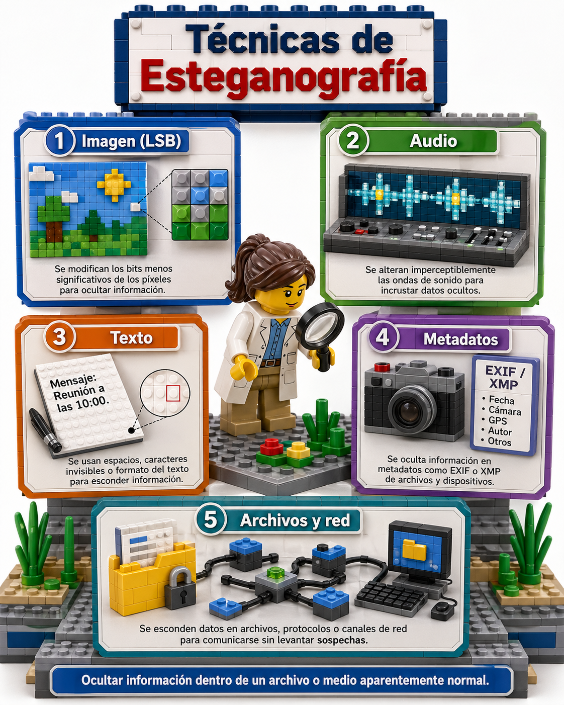

# Esteganografía: conceptos, técnicas y herramientas

## 1. Propósito 

Explicar qué es la esteganografía, cómo funciona a nivel conceptual, cuáles son sus técnicas más comunes y qué herramientas se usan para estudiarla o analizarla. Está orientado a formación, investigación, ciberseguridad defensiva, análisis forense digital, protección de propiedad intelectual y ejercicios controlados de laboratorio.

No debe utilizarse para ocultar actividad ilícita, evadir controles de seguridad, filtrar información confidencial o encubrir malware. En entornos profesionales, cualquier uso debe contar con autorización y trazabilidad.

---

## 2. ¿Qué es la esteganografía?

La esteganografía es la técnica de ocultar información dentro de otro contenido aparentemente normal, llamado **medio portador** o **cover object**. A diferencia de la criptografía, cuyo objetivo principal es hacer ilegible un mensaje, la esteganografía busca ocultar la existencia misma del mensaje.

Ejemplo conceptual:

* Un archivo de imagen parece una fotografía normal.
* Dentro de sus datos se oculta un mensaje, archivo o marca.
* Quien no sabe que existe el mensaje oculto solo ve la imagen original o una versión casi idéntica.

### Esteganografía vs. criptografía

| Aspecto              | Criptografía                                  | Esteganografía                                 |
| -------------------- | --------------------------------------------- | ---------------------------------------------- |
| Objetivo             | Proteger el contenido del mensaje             | Ocultar la existencia del mensaje              |
| Resultado visible    | Texto cifrado o datos aparentemente ilegibles | Archivo aparentemente normal                   |
| Riesgo si se detecta | Se sabe que hay comunicación protegida        | Puede descubrirse que había información oculta |
| Uso conjunto         | Puede cifrar el mensaje antes de ocultarlo    | Puede transportar un mensaje ya cifrado        |

En la práctica, ambas técnicas pueden combinarse: primero se cifra la información y luego se oculta dentro de un medio portador.

---

## 3. Conceptos básicos

### 3.1 Medio portador

Es el archivo o señal donde se oculta la información. Puede ser:

* Imagen: PNG, BMP, JPEG.
* Audio: WAV, AU, MP3.
* Video: MP4, AVI.
* Texto: documentos, espacios, puntuación, caracteres invisibles.
* Red: tiempos, cabeceras o patrones de paquetes.
* Metadatos: campos EXIF, XMP, IPTC u otros.

### 3.2 Carga útil

Es la información que se quiere ocultar. Puede ser un mensaje corto, una clave, una firma, un identificador, una marca de agua o un archivo.

### 3.3 Capacidad

Cantidad de información que puede ocultarse sin degradar demasiado el medio portador. A mayor carga útil, mayor probabilidad de alterar el archivo de forma detectable.

### 3.4 Imperceptibilidad

Grado en que el cambio producido por la inserción de datos pasa desapercibido para una persona o herramienta de análisis.

### 3.5 Robustez

Capacidad del mensaje oculto para sobrevivir a modificaciones del archivo, como compresión, recorte, conversión de formato, cambio de tamaño o ruido.

### 3.6 Estegoanálisis

Disciplina encargada de detectar, extraer o demostrar la presencia de información oculta. Es el equivalente defensivo o forense frente a la esteganografía.

---

## 4. Usos legítimos

La esteganografía tiene aplicaciones válidas cuando se usa con autorización:

1. **Marcas de agua digitales**: identificar autoría o propiedad de imágenes, audio o video.
2. **Protección de propiedad intelectual**: insertar firmas invisibles en contenido distribuido.
3. **Investigación académica**: estudiar canales encubiertos, análisis estadístico y técnicas de detección.
4. **Ciberseguridad defensiva**: entrenar equipos de análisis forense y respuesta a incidentes.
5. **Integridad y trazabilidad**: asociar identificadores ocultos a documentos o materiales sensibles.
6. **Privacidad en contextos legítimos**: proteger metadatos o información sensible cuando existe autorización.

---

## 5. Técnicas principales

## 5.1 Inserción en bits menos significativos, LSB

La técnica **LSB**, por sus siglas en inglés *Least Significant Bit*, modifica los bits menos importantes de los píxeles de una imagen o de las muestras de audio.

En una imagen digital, cada píxel suele representarse con valores de color. Cambiar el bit menos significativo de un canal de color produce una variación mínima, muchas veces imperceptible al ojo humano.

### Ventajas

* Fácil de entender y demostrar en laboratorio.
* Funciona especialmente bien en formatos sin pérdida, como BMP o PNG.
* Permite ocultar datos con bajo impacto visual si la carga es pequeña.

### Desventajas

* Puede detectarse mediante análisis estadístico.
* Es frágil ante compresión con pérdida, como JPEG.
* Puede destruirse al redimensionar, recomprimir o filtrar la imagen.

### Uso recomendado

* Educación.
* CTFs y laboratorios controlados.
* Introducción al estegoanálisis.

---

## 5.2 Esteganografía en dominio de transformación

En lugar de modificar directamente píxeles o muestras, esta técnica altera coeficientes matemáticos obtenidos al transformar el archivo.

Ejemplos:

* DCT, transformada discreta del coseno, usada en JPEG.
* DWT, transformada wavelet.
* Transformadas de frecuencia en audio.

### Ventajas

* Puede ser más robusta que LSB simple.
* Puede resistir cierta compresión o procesamiento.
* Es frecuente en marcas de agua digitales.

### Desventajas

* Es más compleja de implementar y analizar.
* Puede introducir artefactos si se usa incorrectamente.
* Requiere conocimiento del formato y de sus etapas de compresión.

---

## 5.3 Esteganografía en metadatos

Consiste en ocultar información en campos de metadatos de archivos, por ejemplo:

* EXIF en fotografías.
* XMP en imágenes o documentos.
* IPTC en contenido periodístico.
* Comentarios internos de archivos.
* Propiedades de documentos PDF u Office.

### Ventajas

* Muy sencilla de implementar.
* Útil para firmas, etiquetas o identificadores.
* Fácil de auditar con herramientas forenses.

### Desventajas

* No es muy discreta frente a revisiones básicas.
* Los metadatos pueden eliminarse fácilmente.
* No es ideal para ocultación robusta.

### Buenas prácticas defensivas

* Revisar metadatos antes de publicar archivos.
* Eliminar campos innecesarios.
* Controlar GPS, autoría, software usado y comentarios embebidos.

---

## 5.4 Esteganografía por adición o concatenación

Algunos archivos permiten que se agreguen datos al final sin impedir que el visor principal los abra. En estos casos, un archivo puede verse normal, pero contener datos anexos.

### Ventajas

* Conceptualmente simple.
* Puede observarse en análisis forense básico.

### Desventajas

* Es fácil de detectar comparando estructura, tamaño y firmas internas.
* No suele ser robusta.
* Puede romperse al reexportar el archivo.

---

## 5.5 Esteganografía en texto

Oculta información usando características del texto, por ejemplo:

* Espacios dobles o finales de línea.
* Caracteres Unicode invisibles.
* Variaciones de puntuación.
* Mayúsculas/minúsculas.
* Selección de palabras según un patrón.
* Acrósticos.

### Ventajas

* No requiere archivos multimedia.
* Puede aplicarse en mensajes o documentos.

### Desventajas

* Baja capacidad.
* Fragilidad ante corrección automática, normalización o copiado.
* Puede detectarse con revisión de caracteres invisibles o diferencias textuales.

---

## 5.6 Esteganografía en audio

Puede ocultar datos modificando muestras de audio, frecuencias o canales.

Técnicas comunes:

* LSB en muestras de audio.
* Eco oculto.
* Modulación de fase.
* Ocultación en bandas de frecuencia poco perceptibles.

### Ventajas

* El oído humano puede tolerar pequeñas variaciones.
* Algunos métodos son útiles para marcas de agua.

### Desventajas

* Compresión, normalización y filtros pueden destruir datos ocultos.
* Requiere análisis espectral para detectar anomalías.

---

## 5.7 Esteganografía en video

Combina técnicas de imagen y audio, usando fotogramas, canales de audio, subtítulos, metadatos o patrones temporales.

### Ventajas

* Alta capacidad potencial.
* Muchos componentes donde insertar información.

### Desventajas

* Mayor complejidad.
* Recompresión y plataformas de streaming pueden eliminar o alterar datos.
* Análisis forense más costoso.

---

## 5.8 Canales encubiertos en red

Ocultan información en tráfico de red, por ejemplo:

* Campos no usados o poco revisados de cabeceras.
* Tiempos entre paquetes.
* Tamaños de paquetes.
* Orden o frecuencia de solicitudes.

### Ventajas

* Útiles para investigación de seguridad.
* Permiten estudiar riesgos de exfiltración.

### Desventajas

* Pueden violar políticas de seguridad si se usan sin permiso.
* La detección requiere monitoreo y análisis de comportamiento.
* Tienen implicaciones legales y éticas importantes.

---

## 6. Flujo general de trabajo en un laboratorio autorizado

### 6.1 Para estudiar una técnica

1. Definir el objetivo del laboratorio.
2. Elegir un medio portador inocuo.
3. Preparar una carga útil de prueba, sin datos reales ni sensibles.
4. Aplicar una técnica conocida.
5. Comparar el archivo original y el modificado.
6. Analizar tamaño, hash, metadatos, histograma y diferencias visuales.
7. Intentar detectar o extraer la información con herramientas forenses.
8. Documentar hallazgos, limitaciones y riesgos.

### 6.2 Para análisis defensivo

1. Preservar evidencia original.
2. Calcular hashes del archivo.
3. Identificar formato real mediante firma de archivo.
4. Revisar metadatos.
5. Buscar datos anexos o estructuras inconsistentes.
6. Aplicar herramientas de estegoanálisis según el tipo de archivo.
7. Comparar con archivos de referencia si existen.
8. Documentar resultados sin alterar el archivo original.

---

## 7. Indicadores de posible esteganografía

Ningún indicador aislado prueba la presencia de esteganografía. Sin embargo, varios indicios combinados pueden justificar un análisis más profundo:

* Tamaño de archivo inusualmente grande para su resolución o duración.
* Metadatos extraños, excesivos o inconsistentes.
* Hash diferente entre copias aparentemente idénticas.
* Firmas de archivo adicionales dentro del contenido.
* Datos después del final lógico del archivo.
* Ruido visual o patrones anómalos en canales de color.
* Distribuciones estadísticas inusuales en bits menos significativos.
* Archivos multimedia que se degradan de forma extraña al procesarse.
* Diferencias notables entre formato declarado y formato real.

---

## 8. Herramientas útiles

## 8.1 OpenStego

**Tipo:** herramienta gráfica y de línea de comandos.

**Uso principal:** ocultación de datos en imágenes y marcas de agua digitales.

**Cuándo usarla:**

* Formación básica.
* Laboratorios introductorios.
* Demostraciones de marca de agua.

**Fortalezas:**

* Interfaz sencilla.
* Incluye funciones de data hiding y watermarking.
* Apropiada para principiantes.

**Limitaciones:**

* No reemplaza un análisis forense completo.
* Su utilidad depende del formato y del flujo de trabajo usado.

---

## 8.2 Steghide

**Tipo:** herramienta de línea de comandos.

**Uso principal:** ocultar o extraer datos en ciertos formatos de imagen y audio.

**Formatos habituales:** JPEG, BMP, WAV y AU.

**Fortalezas:**

* Soporta compresión, cifrado de datos embebidos y verificación de integridad.
* Muy usada en formación, laboratorios y CTFs.

**Limitaciones:**

* Proyecto antiguo, aunque todavía referenciado.
* Soporte limitado de formatos.
* No debe asumirse como indetectable.

---

## 8.3 ExifTool

**Tipo:** herramienta de línea de comandos y biblioteca Perl.

**Uso principal:** lectura, escritura y auditoría de metadatos en múltiples formatos.

**Cuándo usarla:**

* Revisar metadatos de imágenes, audio, video y documentos.
* Detectar campos sospechosos.
* Limpiar información sensible antes de publicar archivos.

**Fortalezas:**

* Muy amplia compatibilidad de formatos.
* Estándar práctico en análisis de metadatos.
* Disponible para Windows, macOS y Unix.

**Limitaciones:**

* Analiza metadatos, no todos los tipos de esteganografía.
* Puede modificar archivos si se usa sin cuidado.

---

## 8.4 zsteg

**Tipo:** herramienta de línea de comandos.

**Uso principal:** detección de datos ocultos en imágenes PNG y BMP, especialmente patrones LSB.

**Cuándo usarla:**

* CTFs.
* Análisis de imágenes PNG/BMP.
* Búsqueda de datos ocultos en planos de bits.

**Fortalezas:**

* Enfocada en estegoanálisis de PNG/BMP.
* Automatiza pruebas comunes.

**Limitaciones:**

* No cubre todos los formatos.
* Puede generar falsos positivos.
* Requiere interpretación cuidadosa de resultados.

---

## 8.5 Binwalk

**Tipo:** herramienta de análisis de archivos y firmware.

**Uso principal:** detectar archivos embebidos, firmas internas, compresión y datos anexos.

**Cuándo usarla:**

* Sospecha de archivos concatenados.
* Análisis de firmware o binarios.
* Búsqueda de estructuras internas.

**Fortalezas:**

* Muy útil para encontrar contenido embebido.
* Popular en forense, reversing y CTFs.

**Limitaciones:**

* No detecta toda forma de esteganografía.
* Puede encontrar firmas no relevantes.

---

## 8.6 strings, file y hexdump/xxd

**Tipo:** utilidades básicas de análisis.

**Uso principal:** inspección inicial de archivos.

**Ejemplos de uso defensivo:**

* `file`: identificar el tipo real de archivo.
* `strings`: buscar texto legible dentro de binarios.
* `xxd` o `hexdump`: revisar bytes, cabeceras y finales de archivo.

**Fortalezas:**

* Disponibles en muchos sistemas.
* Útiles para triage rápido.

**Limitaciones:**

* Requieren experiencia para interpretar resultados.
* No automatizan estegoanálisis avanzado.

---

## 8.7 Audacity y Sonic Visualiser

**Tipo:** herramientas de análisis y edición de audio.

**Uso principal:** inspección visual y auditiva de señales.

**Cuándo usarlas:**

* Revisar espectrogramas.
* Detectar patrones visuales en audio.
* Comparar señales originales y modificadas.

**Fortalezas:**

* Permiten observar frecuencias y anomalías.
* Útiles en análisis educativo y forense.

**Limitaciones:**

* No extraen automáticamente todos los mensajes ocultos.
* Requieren interpretación humana.

---

## 9. Comparativa rápida de herramientas

| Herramienta      | Mejor para                    | Tipo de archivo                | Nivel               |
| ---------------- | ----------------------------- | ------------------------------ | ------------------- |
| OpenStego        | Aprendizaje y marcas de agua  | Imágenes                       | Básico              |
| Steghide         | Laboratorios con imagen/audio | JPEG, BMP, WAV, AU             | Intermedio          |
| ExifTool         | Metadatos                     | Muchos formatos                | Básico-intermedio   |
| zsteg            | LSB en imágenes               | PNG, BMP                       | Intermedio          |
| Binwalk          | Archivos embebidos            | Binarios, firmware, multimedia | Intermedio-avanzado |
| strings/file/xxd | Triage inicial                | Casi cualquier archivo         | Básico-intermedio   |
| Audacity         | Audio y espectrogramas        | WAV, MP3 y otros               | Básico-intermedio   |

---

## 10. Metodología defensiva de análisis

### Paso 1: Preservación

* Trabajar sobre una copia.
* Calcular hash del archivo original.
* Registrar fecha, origen y contexto.

### Paso 2: Identificación

* Confirmar tipo real del archivo.
* Revisar extensión vs. firma mágica.
* Verificar tamaño y estructura.

### Paso 3: Metadatos

* Extraer metadatos.
* Revisar campos inusuales.
* Comparar con archivos similares.

### Paso 4: Estructura interna

* Buscar contenido anexado.
* Revisar firmas embebidas.
* Inspeccionar cabecera y final del archivo.

### Paso 5: Análisis específico por formato

* Imágenes PNG/BMP: revisar planos de bits, canales y zsteg.
* JPEG: considerar técnicas en dominio de transformación.
* Audio: revisar espectrograma y patrones de frecuencia.
* Documentos: revisar objetos internos, macros, metadatos y contenido incrustado.

### Paso 6: Correlación

* Ninguna herramienta debe tomarse como prueba definitiva por sí sola.
* Correlacionar hallazgos con contexto, hashes, comportamiento y evidencia adicional.

### Paso 7: Documentación

Un informe básico debe incluir:

* Archivo analizado.
* Hashes.
* Herramientas y versiones.
* Procedimiento.
* Hallazgos.
* Limitaciones.
* Conclusión con nivel de confianza.

---

## 11. Buenas prácticas de seguridad

### Para organizaciones

* Bloquear o inspeccionar archivos de alto riesgo en canales sensibles.
* Eliminar metadatos en publicaciones externas.
* Aplicar DLP y monitoreo de anomalías.
* Capacitar a equipos SOC y forenses.
* Registrar transferencias de archivos.
* Usar entornos aislados para análisis.

### Para investigadores

* Usar datos ficticios.
* Documentar cada prueba.
* Evitar archivos de terceros sin autorización.
* No ejecutar archivos desconocidos fuera de sandbox.
* Mantener versiones de herramientas registradas.

### Para publicación de archivos

* Revisar metadatos antes de publicar.
* Reexportar imágenes si se necesita eliminar contenido oculto simple.
* Usar herramientas de sanitización.
* Evitar publicar originales con GPS, autoría interna o historial de edición.

---

## 12. Riesgos y limitaciones

La esteganografía no garantiza seguridad por sí sola. Sus principales riesgos son:

* Falsa sensación de invisibilidad.
* Detección por análisis estadístico.
* Pérdida de información al convertir o comprimir archivos.
* Falsos positivos durante análisis.
* Dependencia de herramientas específicas.
* Posibles implicaciones legales si se usa sin autorización.

Un mensaje oculto puede desaparecer si el archivo se sube a una red social, se recomprime, se recorta, se cambia de formato o se limpia con una herramienta de sanitización.

---

## 13. Ejercicios seguros sugeridos

### Ejercicio 1: Comparación visual y de hash

Objetivo: comprender que dos archivos pueden verse iguales y ser distintos internamente.

1. Crear una copia de una imagen de prueba.
2. Modificar mínimamente la copia con una herramienta autorizada.
3. Comparar los hashes de ambos archivos.
4. Observar si el cambio es visible.
5. Documentar diferencias de tamaño, hash y metadatos.

### Ejercicio 2: Auditoría de metadatos

Objetivo: aprender a revisar información oculta o poco visible en archivos.

1. Tomar una foto de prueba.
2. Revisar sus metadatos.
3. Identificar campos como cámara, fecha, software y ubicación si existe.
4. Crear una copia sanitizada.
5. Comparar metadatos antes y después.

### Ejercicio 3: Análisis de imagen PNG/BMP

Objetivo: detectar indicios de manipulación en imágenes sin pérdida.

1. Usar imágenes de laboratorio.
2. Revisar tipo real de archivo.
3. Analizar metadatos.
4. Revisar planos de bits con herramientas especializadas.
5. Registrar posibles falsos positivos.

### Ejercicio 4: Espectrograma de audio

Objetivo: observar cómo la información puede aparecer en el dominio de frecuencia.

1. Usar un audio de prueba.
2. Abrirlo en una herramienta de análisis de espectrograma.
3. Revisar patrones visuales inusuales.
4. Comparar con otro audio generado de forma normal.

---

## 14. Plantilla de informe de análisis

**Título:** Análisis esteganográfico de archivo

**Analista:**
**Fecha:**
**Archivo:**
**Origen:**
**Hash SHA-256:**
**Tipo declarado:**
**Tipo detectado:**

### Herramientas utilizadas

* Herramienta:
* Versión:
* Sistema operativo:

### Procedimiento

1. Preservación del archivo.
2. Identificación de formato.
3. Revisión de metadatos.
4. Análisis estructural.
5. Análisis específico por formato.
6. Correlación de resultados.

### Hallazgos

* Hallazgo 1:
* Hallazgo 2:
* Hallazgo 3:

### Interpretación

Describir si los hallazgos sugieren presencia de información oculta, manipulación, contenido embebido, metadatos sensibles o ausencia de indicios relevantes.

### Limitaciones

Indicar herramientas no utilizadas, formatos no cubiertos, falta de archivo original de referencia o imposibilidad de validar ciertos resultados.

### Conclusión

Clasificar el resultado con un nivel de confianza:

* Bajo.
* Medio.
* Alto.

---

## 15. Glosario

**Canal encubierto:** medio de comunicación que transmite información de forma no evidente.
**Carga útil:** datos ocultos dentro del medio portador.
**Cover object:** archivo original usado como contenedor.
**DCT:** transformada discreta del coseno.
**Estegoanálisis:** detección o análisis de información oculta.
**EXIF:** metadatos comunes en fotografías digitales.
**Hash:** huella criptográfica usada para verificar integridad.
**Imperceptibilidad:** capacidad de ocultar cambios a la percepción humana o herramientas básicas.
**LSB:** bit menos significativo.
**Marca de agua:** información oculta o visible usada para identificar propiedad o procedencia.
**Metadatos:** datos que describen otros datos, como autor, fecha, cámara o ubicación.
**Robustez:** resistencia del mensaje oculto frente a modificaciones del archivo.

---

## 16. Recomendaciones finales

* Usar esteganografía solo en contextos autorizados.
* No confundir ocultación con seguridad completa.
* Combinar análisis automático con revisión manual.
* Mantener evidencia original intacta.
* Documentar herramientas, versiones y metodología.
* Preferir archivos de laboratorio para aprendizaje.
* En entornos corporativos, integrar análisis de metadatos, DLP, sandboxing y monitoreo de anomalías.

La esteganografía es una disciplina útil para comprender cómo se puede ocultar información en medios digitales, pero su valor profesional depende de un uso ético, controlado y verificable.
