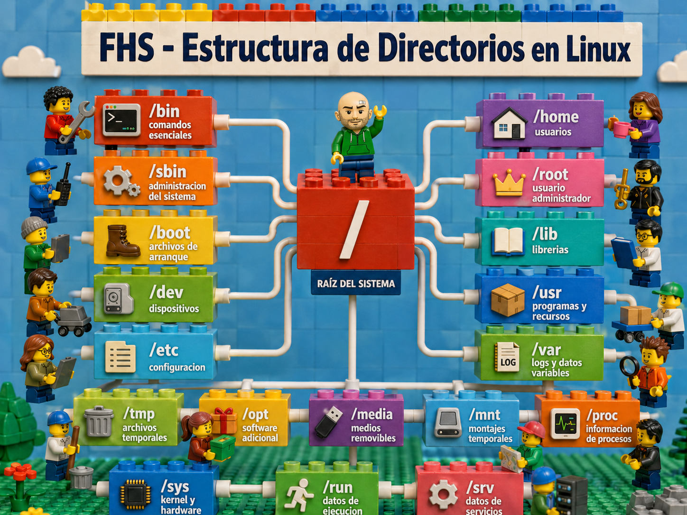

# Estructura de directorios en Linux / Kali Linux

Kali linux impelemnta su estructura de directorios sigue el **Filesystem Hierarchy Standard**, conocido como **FHS**, lo que permite ubicar de forma predecible binarios, configuraciones, librerías, archivos temporales, registros y datos de aplicaciones. 
---

## Objetivo de la unididad.

Estudiar y desarrollar de manera individual los ejercicios propuestos en esta sesión.

**NOTA:** La actividad no se solicita evidencia, trabajo indivu=idual de estudio.

- Comprender cómo está organizada la estructura de directorios en Kali Linux.
- Diferenciar entre directorios del sistema, del usuario, de configuración, de logs, de programas y de archivos temporales.
- Usar comandos básicos para navegar, inspeccionar y analizar rutas.
- Entender qué carpetas se deben modificar y cuáles solo se deben consultar.

---

# **FHS** (Filesystem Hierarchy Standard)



## 2. Concepto base: todo nace desde `/`

En Linux no existe una estructura como `C:\`, `D:\` o `E:\` de Windows. Todo el sistema parte de una única raíz llamada:

```bash
/
```

A partir de `/` cuelgan todos los directorios principales:

```bash
/
├── bin
├── boot
├── dev
├── etc
├── home
├── lib
├── media
├── mnt
├── opt
├── proc
├── root
├── run
├── sbin
├── srv
├── sys
├── tmp
├── usr
└── var
```

El FHS define directorios requeridos en `/`, como `/bin`, `/boot`, `/dev`, `/etc`, `/lib`, `/media`, `/mnt`, `/opt`, `/run`, `/sbin`, `/srv`, `/tmp`, `/usr` y `/var`; también contempla directorios como `/home` y `/root` cuando el sistema los usa. ([Referenciados de Linux][2])

---

## 3. Rutas absolutas y rutas relativas

Una **ruta absoluta** empieza desde `/`.

Ejemplos:

```bash
/etc/passwd
/home/kali/Documentos
/usr/bin/nmap
/var/log
```

Una **ruta relativa** depende del lugar donde el usuario se encuentre ubicado.

Ejemplo:

```bash
cd /home/kali
cd Documentos
```

En este caso, `Documentos` es una ruta relativa porque no empieza desde `/`.

Comando para saber dónde se encuentra el usuario:

```bash
pwd
```

Ejemplo de salida:

```bash
/home/kali
```

---

## 4. Directorio `/`: raíz del sistema

El directorio `/` es la base de todo el sistema. Contiene lo mínimo necesario para arrancar, reparar, restaurar o recuperar el sistema. El estándar FHS indica que la raíz debe mantenerse lo más pequeña y organizada posible; no se recomienda crear carpetas personalizadas directamente dentro de `/`. 

### Comandos útiles

```bash
cd /
ls
ls -l /
```

### Ejercicio 1: explorar la raíz

Ejecutar:

```bash
cd /
pwd
ls
ls -l
```

Responda:

1. ¿Qué directorios aparecen en `/`?
2. ¿Existe `/home`?
3. ¿Existe `/root`?
4. ¿Existe `/usr`?
5. ¿Existe `/var`?

---

## 5. Directorio `/bin`

`/bin` contiene comandos esenciales que pueden usar tanto usuarios normales como administradores. Estos comandos deben estar disponibles incluso cuando otras partes del sistema no estén montadas. El FHS menciona comandos como `cat`, `chmod`, `cp`, `date`, `df`, `echo`, `kill`, `ls`, `mkdir`, `mv`, `pwd`, `rm`, `rmdir`, `sh`, `su`, `umount` y `uname`.

Ejemplos de comandos ubicados normalmente en `/bin` o enlazados desde allí:

```bash
ls
cp
mv
mkdir
rm
cat
echo
pwd
```

### Comandos útiles

Ejecte y averige que hace cada uno de estos comandos.
```bash
ls /bin
ls -l /bin/ls
which ls
type ls
```

### Ejercicio 2: localizar comandos básicos

Ejecutar:

```bash
which ls
which cp
which mkdir
which bash
```

Responder:

1. ¿En qué ruta está `ls`?
2. ¿En qué ruta está `bash`?
3. ¿Todos están en `/bin` o alguno aparece en `/usr/bin`?
4. ¿Qué diferencia se observa entre `which` y `type` si se ejecuta esto?

```bash
type cd
which cd
```

Pista: `cd` suele ser una orden interna del shell, no un binario normal.

---

## 6. Directorio `/sbin`

`/sbin` contiene binarios esenciales de administración del sistema. Son herramientas relacionadas con arranque, recuperación, reparación, apagado, particiones, sistemas de archivos y configuración del sistema. El FHS indica que `/sbin` almacena binarios esenciales para arrancar, restaurar, recuperar o reparar el sistema, mientras que otros programas administrativos no esenciales suelen ir en `/usr/sbin` o `/usr/local/sbin`. 

Ejemplos habituales:

```bash
shutdown
reboot
fsck
mkfs
ip
```

### Comandos útiles

```bash
ls /sbin
ls /usr/sbin
which reboot
which shutdown
```

### Ejercicio 3: comparar `/bin` y `/sbin`

Ejecutar:

```bash
ls /bin | head
ls /sbin | head
ls /usr/bin | head
ls /usr/sbin | head
```

El estudiante debe responder:

1. ¿Qué tipo de comandos aparecen en `/bin`?
2. ¿Qué tipo de comandos aparecen en `/sbin`?
3. ¿Por qué se considera que algunos comandos administrativos requieren `sudo`?

---

## 7. Directorio `/boot`

`/boot` guarda archivos necesarios para el proceso de arranque, como el kernel, initramfs y archivos del cargador de arranque. El FHS indica que `/boot` contiene datos usados antes de que el kernel empiece a ejecutar programas en modo usuario. 

Ejemplos de archivos que se pueden encontrar:

```bash
vmlinuz-*
initrd.img-*
grub/
config-*
System.map-*
```

### Comandos útiles

```bash
ls /boot
ls -lh /boot
```

### Ejercicio 4: inspeccionar `/boot`

Ejecutar:

```bash
ls -lh /boot
```

Responder:

1. ¿Se observan archivos que empiezan por `vmlinuz`?
2. ¿Se observan archivos que empiezan por `initrd.img`?
3. ¿Existe el directorio `/boot/grub`?
4. ¿Por qué sería peligroso borrar archivos en `/boot`?

---

## 8. Directorio `/dev`

`/dev` contiene archivos especiales que representan dispositivos. En Linux, muchos dispositivos se manejan como archivos: discos, particiones, terminales, pseudoaleatorios, entradas y salidas especiales. El FHS define `/dev` como la ubicación de archivos de dispositivo o archivos especiales. 

Ejemplos:

```bash
/dev/sda
/dev/sda1
/dev/null
/dev/zero
/dev/random
/dev/tty
```

### Significado de algunos archivos especiales

| Ruta          | Función                          |
| ------------- | -------------------------------- |
| `/dev/null`   | Descarta todo lo que se le envía |
| `/dev/zero`   | Genera ceros continuamente       |
| `/dev/random` | Genera datos aleatorios          |
| `/dev/tty`    | Terminal actual                  |
| `/dev/sda`    | Disco físico o virtual           |
| `/dev/sda1`   | Partición del disco              |

### Comandos útiles

```bash
ls /dev
lsblk
df -h
```

### Ejercicio 5: identificar discos y particiones

Ejecutar:

```bash
lsblk
df -h
```

Responder:

1. ¿Qué discos detecta el sistema?
2. ¿Qué particiones aparecen?
3. ¿Cuál partición está montada en `/`?
4. ¿Qué diferencia se observa entre `lsblk` y `df -h`?

---

## 9. Directorio `/etc`

`/etc` contiene archivos de configuración del sistema y de muchas aplicaciones. Según el FHS, `/etc` almacena configuración específica del equipo; estos archivos controlan el comportamiento de programas y no deben ser binarios ejecutables. 

Ejemplos importantes:

```bash
/etc/passwd
/etc/group
/etc/shadow
/etc/hostname
/etc/hosts
/etc/fstab
/etc/apt/sources.list
/etc/ssh/sshd_config
```

En Kali Linux, algunas herramientas también guardan configuraciones en `/etc`. Por ejemplo, la documentación oficial de Kali menciona `/etc/beef-xss/config.yaml` como archivo de configuración de BeEF-XSS. 
### Comandos seguros

```bash
ls /etc
cat /etc/hostname
cat /etc/os-release
cat /etc/passwd
```

No se deben editar archivos de `/etc` sin saber exactamente qué se está haciendo.

### Ejercicio 6: analizar archivos de configuración

El estudiante debe ejecutar:

```bash
cat /etc/os-release
cat /etc/hostname
head /etc/passwd
```

El estudiante debe responder:

1. ¿Qué distribución aparece en `/etc/os-release`?
2. ¿Cuál es el nombre del equipo?
3. ¿Qué usuarios aparecen en las primeras líneas de `/etc/passwd`?
4. ¿Por qué `/etc/shadow` no se puede leer como usuario normal?

---

## 10. Directorio `/home`

`/home` contiene los directorios personales de los usuarios normales. En Kali, si el usuario está usando el usuario estándar `kali`, normalmente su carpeta personal será:

```bash
/home/kali
```

Kali cambió a una política de usuario no-root por defecto desde la versión 2020.1; en imágenes Live o máquinas precreadas, las credenciales por defecto suelen ser usuario `kali` y contraseña `kali`. 

El FHS explica que `/home` es un concepto estándar, pero específico del sitio o sistema; además, los archivos de configuración de usuario suelen guardarse como archivos ocultos que empiezan con `.` dentro del home. 

Ejemplos:

```bash
/home/kali/Desktop
/home/kali/Documents
/home/kali/Downloads
/home/kali/.bashrc
/home/kali/.config
```

### Símbolos importantes

| Símbolo | Significado                           |
| ------- | ------------------------------------- |
| `~`     | Carpeta personal del usuario actual   |
| `.`     | Directorio actual                     |
| `..`    | Directorio padre                      |
| `-`     | Directorio anterior, usado con `cd -` |

### Comandos útiles

```bash
cd ~
pwd
ls
ls -a
ls -la
```

### Ejercicio 7: trabajar en el home del usuario

Ejecutar:

```bash
cd ~
pwd
ls
ls -a
```

El estudiante debe responder:

1. ¿Qué ruta muestra `pwd`?
2. ¿Qué diferencia hay entre `ls` y `ls -a`?
3. ¿Qué archivos ocultos se observan?
4. ¿Qué significa que un archivo empiece con punto?

---

## 11. Directorio `/root`

`/root` es la carpeta personal del usuario administrador `root`. No debe confundirse con `/`, que es la raíz del sistema. El FHS recomienda `/root` como ubicación por defecto del home del usuario root. 

Diferencia clave:

```bash
/       # raíz del sistema
/root   # home del usuario root
```

En Kali, normalmente se trabaja con un usuario estándar y se usa `sudo` cuando se requieren privilegios administrativos. La documentación de Kali explica que, cuando se necesita una sesión de superusuario temporal, puede usarse `sudo su`, y al terminar se sale con `exit` o `CTRL+D`. ([Kali Linux][4])

### Comandos seguros

```bash
ls /root
sudo ls /root
```

### Ejercicio 8: diferenciar `/` y `/root`

El estudiante debe ejecutar:

```bash
ls /
ls /root
sudo ls /root
```

El estudiante debe responder:

1. ¿Qué ocurre al intentar listar `/root` sin `sudo`?
2. ¿Por qué `/root` tiene permisos restringidos?
3. ¿Cuál es la diferencia entre `/` y `/root`?

---

## 12. Directorio `/usr`

`/usr` es una de las partes más grandes del sistema. Contiene programas, librerías, documentación, datos compartidos y archivos estáticos. Según el FHS, `/usr` es una jerarquía secundaria con datos compartibles y de solo lectura; la información específica del equipo o que cambia con el tiempo debe guardarse en otro lugar. 

Subdirectorios importantes:

| Ruta         | Función                                            |
| ------------ | -------------------------------------------------- |
| `/usr/bin`   | La mayoría de comandos de usuario                  |
| `/usr/sbin`  | Comandos administrativos no esenciales             |
| `/usr/lib`   | Librerías                                          |
| `/usr/share` | Datos independientes de arquitectura               |
| `/usr/local` | Software instalado localmente por el administrador |
| `/usr/src`   | Código fuente de referencia                        |

El FHS también indica que `/usr/local` está destinado a software instalado localmente por el administrador, y que el software colocado directamente en `/` o `/usr` puede ser sobrescrito por actualizaciones del sistema. 

En Kali, muchas herramientas de seguridad instalan binarios en rutas como `/usr/bin` y datos auxiliares en `/usr/share`. Por ejemplo, la documentación de Kali menciona una ruta de Metasploit en `/usr/share/metasploit-framework/config/database.yml`. ([Kali Linux][3])

### Comandos útiles

```bash
ls /usr
ls /usr/bin | head
ls /usr/share | head
which nmap
whereis nmap
```

### Ejercicio 9: ubicar herramientas de Kali

Ejecutar:

```bash
which nmap
whereis nmap
which msfconsole
whereis msfconsole
```

Responder:

1. ¿Dónde está el ejecutable de `nmap`?
2. ¿Dónde está `msfconsole`, si está instalado?
3. ¿Qué muestra `whereis` que no muestra `which`?
4. ¿Por qué muchas herramientas tienen archivos en `/usr/share`?

---

## 13. Directorio `/var`

`/var` almacena datos variables: archivos que cambian durante el funcionamiento normal del sistema. Incluye logs, cachés, colas, bases de datos de estado y datos temporales más persistentes. El FHS define `/var` como la ubicación de datos variables, incluyendo datos administrativos, logs, spools y archivos transitorios; también separa estos datos de `/usr` para permitir que `/usr` pueda tratarse como una zona estática. ([Referenciados de Linux][2])

Subdirectorios importantes:

| Ruta           | Función                                      |
| -------------- | -------------------------------------------- |
| `/var/log`     | Registros del sistema                        |
| `/var/cache`   | Cachés de aplicaciones                       |
| `/var/lib`     | Estado persistente de aplicaciones           |
| `/var/spool`   | Colas de procesamiento                       |
| `/var/tmp`     | Temporales más persistentes que `/tmp`       |
| `/var/backups` | Copias de respaldo automáticas o del sistema |

### `/var/log`

Aquí viven muchos logs:

```bash
/var/log/auth.log
/var/log/syslog
/var/log/dpkg.log
/var/log/apt/
```

En algunas instalaciones, algunos nombres pueden variar según el sistema de logging usado.

### `/var/spool`

`/var/spool` contiene datos en espera de procesamiento posterior, como colas de impresión o correo. 

### `/var/tmp`

`/var/tmp` guarda archivos temporales que deben sobrevivir entre reinicios más que los de `/tmp`. El FHS indica que los archivos de `/var/tmp` son más persistentes que los de `/tmp` y no deben eliminarse automáticamente al arrancar. 

### Ejercicio 10: revisar logs

Ejecutar:

```bash
ls /var/log
ls -lh /var/log
```

Ejecutar:

```bash
sudo tail -n 20 /var/log/dpkg.log
```

Responder:

1. ¿Qué archivos de log existen?
2. ¿Cuál parece tener más tamaño?
3. ¿Qué información muestra `dpkg.log`?
4. ¿Por qué algunos logs requieren `sudo`?

---

## 14. Directorio `/tmp`

`/tmp` guarda archivos temporales. Los programas no deben asumir que los archivos allí se conservan indefinidamente. El FHS indica que `/tmp` debe estar disponible para programas que necesiten archivos temporales, y recomienda que su contenido pueda ser eliminado al arrancar. 

### Comandos útiles

```bash
ls /tmp
touch /tmp/prueba.txt
ls -l /tmp/prueba.txt
rm /tmp/prueba.txt
```

### Ejercicio 11: crear archivos temporales

Ejecutar:

```bash
touch /tmp/archivo_temporal.txt
echo "Prueba en tmp" > /tmp/archivo_temporal.txt
cat /tmp/archivo_temporal.txt
rm /tmp/archivo_temporal.txt
```

Responder:

1. ¿Para qué sirve `/tmp`?
2. ¿Sería buena idea guardar allí documentos importantes?
3. ¿Qué diferencia hay entre `/tmp` y `/var/tmp`?

---

## 15. Directorio `/opt`

`/opt` está reservado para paquetes de software adicionales. Según el FHS, un paquete instalado en `/opt` debe ubicar sus archivos estáticos dentro de una estructura como `/opt/<paquete>` o `/opt/<proveedor>`, mientras que su configuración específica puede ir en `/etc/opt` y sus datos variables en `/var/opt`. 
Ejemplos posibles:

```bash
/opt/mi_programa
/opt/google
/opt/vmware
```

### Ejercicio 12: inspeccionar `/opt`

Ejecutar:

```bash
ls /opt
ls -l /opt
```

Responder:

1. ¿Hay software instalado en `/opt`?
2. ¿Qué diferencia habría entre instalar algo en `/opt` y en `/usr/local`?
3. ¿Por qué no conviene instalar software manual directamente en `/usr/bin`?

---

## 16. Directorio `/media`

`/media` se usa como punto de montaje para medios removibles, como memorias USB, discos externos, CD-ROM o unidades similares. El FHS describe `/media` como una ubicación con subdirectorios usados como puntos de montaje para medios removibles. 

Ejemplos:

```bash
/media/kali/USB
/media/cdrom
```

### Comandos útiles

```bash
ls /media
lsblk
mount
```

### Ejercicio 13: identificar medios removibles

La persona usuaria debe conectar una memoria USB y ejecutar:

```bash
lsblk
ls /media
ls /media/$USER
```

Responder:

1. ¿Aparece el dispositivo USB en `lsblk`?
2. ¿En qué ruta se montó?
3. ¿Qué diferencia hay entre el dispositivo `/dev/sdX` y el punto de montaje `/media/...`?

---

## 17. Directorio `/mnt`

`/mnt` es un punto de montaje temporal usado por el administrador del sistema. El FHS indica que `/mnt` existe para que el administrador monte temporalmente un sistema de archivos cuando sea necesario. 

Ejemplo:

```bash
sudo mount /dev/sdb1 /mnt
```

No se debe ejecutar ese comando si no se sabe exactamente qué dispositivo se está montando.

### Ejercicio 14: comparar `/media` y `/mnt`

Responder teóricamente:

1. ¿Para qué se usa `/media`?
2. ¿Para qué se usa `/mnt`?
3. ¿Cuál suele usarse automáticamente al conectar una USB?
4. ¿Cuál se usaría para montar manualmente una partición durante una práctica?

---

## 18. Directorio `/proc`

`/proc` es un sistema de archivos virtual. No contiene archivos normales guardados en disco; muestra información del kernel y de los procesos en ejecución.

Ejemplos:

```bash
/proc/cpuinfo
/proc/meminfo
/proc/version
/proc/mounts
/proc/[PID]
```

### Comandos útiles

```bash
cat /proc/cpuinfo
cat /proc/meminfo
cat /proc/version
ls /proc
```

### Ejercicio 15: consultar información del sistema

Ejecutar:

```bash
cat /proc/cpuinfo | head
cat /proc/meminfo | head
cat /proc/version
```

Responder:

1. ¿Qué información muestra `/proc/cpuinfo`?
2. ¿Qué información muestra `/proc/meminfo`?
3. ¿Por qué `/proc` se considera virtual?

---

## 19. Directorio `/sys`

`/sys` también es un sistema de archivos virtual. Expone información sobre dispositivos, controladores, buses, kernel y hardware.

Ejemplos:

```bash
/sys/class
/sys/block
/sys/devices
```

### Comandos útiles

```bash
ls /sys
ls /sys/class
ls /sys/block
```

### Ejercicio 16: explorar `/sys`
Ejecutar:

```bash
ls /sys
ls /sys/block
```

Responder:

1. ¿Qué dispositivos de bloque aparecen?
2. ¿Coinciden con lo que muestra `lsblk`?
3. ¿Qué diferencia hay entre `/dev`, `/proc` y `/sys`?

---

## 20. Directorio `/run`

`/run` almacena datos temporales de ejecución generados desde el arranque actual: archivos PID, sockets y datos de servicios activos. El FHS indica que `/run` contiene información del sistema desde que fue arrancado y que esos archivos deben limpiarse al inicio del proceso de arranque. 

Ejemplos:

```bash
/run/sshd
/run/user
/run/systemd
```

### Ejercicio 17: inspeccionar datos de ejecución

Ejecutar:

```bash
ls /run
ls /run/user
```

Responder:

1. ¿Qué servicios o procesos aparecen?
2. ¿Qué se cree que pasaría con esos archivos después de reiniciar?
3. ¿Por qué `/run` no es lugar para guardar documentos?

---

## 21. Directorio `/srv`

`/srv` contiene datos servidos por el sistema, por ejemplo datos de servicios web, FTP, rsync o CVS. El FHS lo define como lugar para datos específicos del sitio que son servidos por el sistema. 

Ejemplos posibles:

```bash
/srv/www
/srv/ftp
/srv/rsync
```

En una instalación normal de Kali puede estar vacío.

### Ejercicio 18: revisar `/srv`

Ejecutar:

```bash
ls /srv
```

Responder:

1. ¿Está vacío?
2. ¿Qué tipo de servicio podría usar `/srv/www`?
3. ¿Por qué los datos de un sitio web no deberían guardarse directamente en `/root`?

---

## 22. Directorios `/lib`, `/lib64` y similares

`/lib` contiene librerías esenciales necesarias para arrancar el sistema y ejecutar comandos ubicados en `/bin` y `/sbin`. El FHS indica que `/lib` contiene imágenes de librerías compartidas necesarias para el arranque y para los comandos de la raíz del sistema. ([Referenciados de Linux][2])

En sistemas de 64 bits también se pueden encontrar:

```bash
/lib64
/usr/lib
/usr/lib64
```

### Comandos útiles

```bash
ls /lib
ls /lib64
ldd /bin/ls
```

### Ejercicio 19: ver librerías de un comando

Ejecutar:

```bash
ldd /bin/ls
```

Responder:

1. ¿Qué librerías necesita `ls`?
2. ¿Aparecen rutas hacia `/lib` o `/usr/lib`?
3. ¿Qué ocurriría si faltaran esas librerías?

---

# 23. Archivos ocultos y configuración de usuario

En Linux, los archivos ocultos empiezan con punto.

Ejemplos:

```bash
.bashrc
.profile
.config
.local
.cache
.ssh
```

Estos archivos suelen vivir en el directorio personal del usuario:

```bash
/home/kali/.bashrc
/home/kali/.config
/home/kali/.ssh
```

El FHS menciona que los archivos de configuración específicos de usuario se almacenan en el home como archivos que empiezan con `.`. 

### Ejercicio 20: analizar archivos ocultos

El estudiante debe ejecutar:

```bash
cd ~
ls -la
```

El estudiante debe responder:

1. ¿Qué archivos ocultos aparecen?
2. ¿Existe `.bashrc`?
3. ¿Existe `.config`?
4. ¿Qué diferencia hay entre configuración del usuario en `~` y configuración global en `/etc`?

---

# 24. Permisos básicos en directorios

Cuando se ejecuta:

```bash
ls -l
```

se verá algo como:

```bash
drwxr-xr-x 2 kali kali 4096 abr 27 10:00 Documentos
-rw-r--r-- 1 kali kali  120 abr 27 10:00 nota.txt
```

Interpretación:

```bash
d rwx r-x r-x
│ │   │   │
│ │   │   └── permisos para otros
│ │   └────── permisos para el grupo
│ └────────── permisos para el dueño
└──────────── tipo: d = directorio, - = archivo
```

Permisos:

| Letra | Significado                                 |
| ----- | ------------------------------------------- |
| `r`   | read / leer                                 |
| `w`   | write / escribir                            |
| `x`   | execute / ejecutar o entrar a un directorio |

### Ejercicio 21: crear directorios y permisos

Ejecutar en su directorio home:

```bash
cd ~
mkdir laboratorio-directorios
cd laboratorio-directorios
mkdir publico privado temporal
touch publico/info.txt privado/secreto.txt temporal/prueba.tmp
ls -l
```

Después, el estudiante cambia permisos:

```bash
chmod 700 privado
chmod 755 publico
chmod 777 temporal
ls -l
```

Responder:

1. ¿Qué permisos tiene `privado`?
2. ¿Qué permisos tiene `publico`?
3. ¿Por qué `777` puede ser peligroso?
4. ¿Qué significa `700`?

Limpieza:

```bash
cd ~
rm -r laboratorio-directorios
```

---

# 25. Comandos esenciales para estudiar la estructura

| Comando       | Uso                                 |
| ------------- | ----------------------------------- |
| `pwd`         | Muestra el directorio actual        |
| `ls`          | Lista archivos                      |
| `ls -l`       | Lista con detalles                  |
| `ls -a`       | Muestra ocultos                     |
| `cd`          | Cambia de directorio                |
| `tree`        | Muestra árbol de directorios        |
| `find`        | Busca archivos o directorios        |
| `du -sh`      | Muestra tamaño usado                |
| `df -h`       | Muestra uso de sistemas de archivos |
| `file`        | Identifica tipo de archivo          |
| `stat`        | Muestra metadatos                   |
| `which`       | Ubica ejecutables                   |
| `whereis`     | Ubica binarios, fuentes y manuales  |
| `readlink -f` | Resuelve enlaces simbólicos         |

Si `tree` no está instalado, se puede usar:

```bash
find . -maxdepth 2
```

---

# 26. Práctica guiada completa

## Objetivo

Crear una estructura de práctica dentro del entorno del usuario sin afectar el sistema.

## Paso 1: crear laboratorio

```bash
cd ~
mkdir practica-fhs
cd practica-fhs
mkdir bin etc home usr var tmp
```

## Paso 2: simular archivos

```bash
touch bin/comando.sh
touch etc/config.conf
touch home/nota_usuario.txt
touch usr/programa.txt
touch var/log.txt
touch tmp/temporal.txt
```

## Paso 3: visualizar estructura

```bash
find . -maxdepth 2
```

Salida esperada aproximada:

```bash
.
./bin
./bin/comando.sh
./etc
./etc/config.conf
./home
./home/nota_usuario.txt
./usr
./usr/programa.txt
./var
./var/log.txt
./tmp
./tmp/temporal.txt
```

## Paso 4: responder

1. ¿Qué carpeta simula comandos?
2. ¿Qué carpeta simula configuraciones?
3. ¿Qué carpeta simula datos variables?
4. ¿Qué carpeta simula archivos temporales?
5. ¿Qué carpeta simula datos de usuario?

## Paso 5: limpiar

```bash
cd ~
rm -r practica-fhs
```

---

# 27. Ejercicios de evaluación

## Ejercicio A: identifica la ruta correcta

Se debe indicar en qué directorio se buscaría cada elemento:

| Elemento                          | Directorio probable |
| --------------------------------- | ------------------- |
| Configuración de SSH              | `/etc/ssh`          |
| Logs del sistema                  | `/var/log`          |
| Comandos de usuario               | `/usr/bin` o `/bin` |
| Home del usuario kali             | `/home/kali`        |
| Home del usuario root             | `/root`             |
| Archivos temporales               | `/tmp`              |
| Datos de herramientas instaladas  | `/usr/share`        |
| Dispositivos del sistema          | `/dev`              |
| Información del kernel y procesos | `/proc`             |
| Datos de servicios web/FTP        | `/srv`              |

## Ejercicio B: completa los comandos

1. Mostrar ubicación actual:

```bash
____
```

Respuesta:

```bash
pwd
```

2. Ir al directorio raíz:

```bash
____ /
```

Respuesta:

```bash
cd /
```

3. Listar archivos ocultos:

```bash
ls __
```

Respuesta:

```bash
ls -a
```

4. Ver tamaño de `/var/log`:

```bash
sudo du __ /var/log
```

Respuesta:

```bash
sudo du -sh /var/log
```

5. Buscar dónde está `nmap`:

```bash
____ nmap
```

Respuesta:

```bash
which nmap
```

## Ejercicio C: clasifica directorios

Clasifica cada ruta como **configuración**, **usuario**, **temporal**, **logs**, **binarios**, **dispositivos** o **virtual**.

| Ruta            | Clasificación         |
| --------------- | --------------------- |
| `/etc/passwd`   | Configuración         |
| `/home/kali`    | Usuario               |
| `/tmp`          | Temporal              |
| `/var/log`      | Logs                  |
| `/usr/bin`      | Binarios              |
| `/dev/null`     | Dispositivo           |
| `/proc/cpuinfo` | Virtual               |
| `/sys/class`    | Virtual               |
| `/root`         | Usuario administrador |
| `/boot`         | Arranque              |

---

# 28. Errores comunes que se deben evitar

No se debe confundir `/` con `/root`.
No se deben borrar archivos en `/boot`, `/etc`, `/usr`, `/var/lib` o `/lib` sin saber exactamente qué hacen.
No se debe usar `sudo` si no es necesario.
No se deben guardar documentos importantes en `/tmp`.
No se debe instalar software manual en `/usr/bin`; se debe usar el gestor de paquetes, `/usr/local` o `/opt` según el caso.
No se deben ejecutar comandos destructivos como estos:

```bash
sudo rm -rf /
sudo rm -rf /*
sudo chmod -R 777 /
sudo chown -R usuario:usuario /
```

Estos comandos pueden destruir el sistema.

---

# 29. Resumen general

La estructura de directorios en Kali Linux sigue la lógica de Linux y del FHS. Todo parte desde `/`. Los comandos esenciales se ubican en `/bin` y `/sbin`; la configuración global está en `/etc`; los usuarios trabajan en `/home`; el usuario administrador tiene `/root`; los programas y datos compartidos están en `/usr`; los logs, cachés y estados de aplicaciones están en `/var`; los archivos temporales van en `/tmp`; los dispositivos se representan en `/dev`; y la información virtual del kernel y procesos aparece en `/proc` y `/sys`.

Dominar esta estructura es fundamental para administrar Kali Linux, solucionar errores, ubicar configuraciones, analizar logs, comprender herramientas de pentesting y trabajar de forma segura en la terminal.

[1]: https://www.kali.org/docs/introduction/what-is-kali-linux/ "What is Kali Linux? | Kali Linux Documentation"
[2]: https://refspecs.linuxfoundation.org/FHS_3.0/fhs-3.0.html "Filesystem Hierarchy Standard"
[3]: https://www.kali.org/docs/introduction/default-credentials/ "Kali's Default Credentials | Kali Linux Documentation"
[4]: https://www.kali.org/docs/general-use/enabling-root/ "Enabling Root | Kali Linux Documentation"
