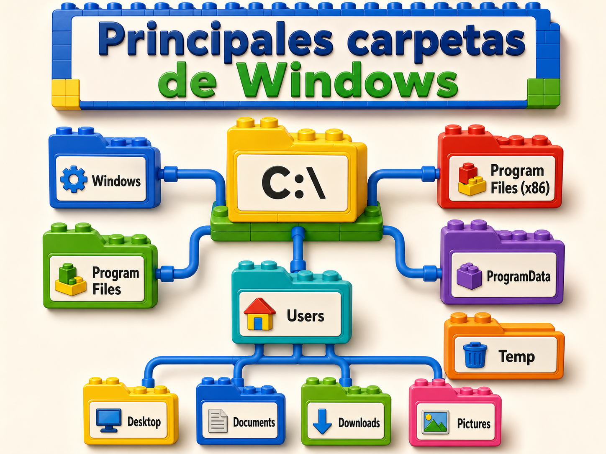

# Manual: Estructura de ficheros en Windows y formatos de archivos

## 1. Introducción

El sistema operativo Windows organiza la información mediante una estructura jerárquica de ficheros y carpetas. Esta organización permite guardar, localizar, modificar, copiar, mover y eliminar archivos de forma ordenada.

Un fichero, también llamado archivo, es una unidad de información almacenada en el equipo. Puede contener texto, imágenes, audio, vídeo, programas, configuraciones o datos de una aplicación. Las carpetas sirven para agrupar archivos y otras carpetas, formando una estructura en forma de árbol.

Este manual presenta los elementos principales de la estructura de ficheros en Windows, los sistemas de archivos más comunes y los formatos de archivos más utilizados.

---

## 2. Objetivos de la unidad.

Al finalizar el estudio de esta unidad, se espera que se puedan reconocer los elementos principales del sistema de archivos de Windows, identificar rutas, diferenciar carpetas y archivos, comprender la función de las extensiones y clasificar formatos de archivos según su uso.

---

## 3. Concepto de fichero, carpeta y directorio

Un **fichero** es un conjunto de datos almacenado con un nombre y, normalmente, con una extensión. Por ejemplo:

```text
informe.docx
imagen.jpg
presupuesto.xlsx
```

Una **carpeta** o **directorio** es un contenedor utilizado para organizar ficheros y otras carpetas. Por ejemplo:

```text
Documentos
Imágenes
Descargas
Escritorio
```

En Windows, las carpetas pueden contener subcarpetas, lo que permite crear una estructura ordenada.

Ejemplo:

```text
Documentos
│
├── Trabajos
│   ├── informe.docx
│   └── resumen.pdf
│
├── Facturas
│   ├── enero.pdf
│   └── febrero.pdf
│
└── Imágenes
    └── logo.png
```

---

## 4. Estructura jerárquica de ficheros en Windows

Windows utiliza una estructura jerárquica, es decir, una organización por niveles. En la parte superior se encuentran las unidades de almacenamiento, como discos duros, memorias USB o particiones.

Ejemplo de unidades:

```text
C:\
D:\
E:\
```

La unidad principal suele ser:

```text
C:\
```

Dentro de ella se almacenan carpetas importantes del sistema operativo y de los usuarios.

Ejemplo básico:

```text
C:\
│
├── Windows
├── Program Files
├── Program Files (x86)
├── Users
├── ProgramData
└── Temp
```

---

## 5. Principales carpetas del sistema Windows



### 5.1 Carpeta Windows

La carpeta **Windows** contiene los archivos principales del sistema operativo.

Ruta habitual:

```text
C:\Windows
```

En esta carpeta se encuentran componentes necesarios para el funcionamiento del sistema. No se recomienda modificar ni eliminar archivos de esta ubicación sin conocimientos técnicos.

---

### 5.2 Carpeta Program Files

La carpeta **Program Files** almacena programas instalados en el equipo.

Ruta habitual:

```text
C:\Program Files
```

En sistemas Windows de 64 bits también puede aparecer:

```text
C:\Program Files (x86)
```

La carpeta **Program Files (x86)** suele contener aplicaciones de 32 bits.

---

### 5.3 Carpeta Users

La carpeta **Users** contiene los perfiles de usuario del equipo.

Ruta habitual:

```text
C:\Users
```

Dentro de esta carpeta aparece una carpeta por cada usuario registrado.

Ejemplo:

```text
C:\Users\Carlos
```

Dentro del perfil de usuario se encuentran carpetas comunes como:

```text
Desktop
Documents
Downloads
Pictures
Music
Videos
```

En Windows en español pueden mostrarse como:

```text
Escritorio
Documentos
Descargas
Imágenes
Música
Vídeos
```

---

### 5.4 Carpeta ProgramData

La carpeta **ProgramData** almacena datos compartidos por aplicaciones y usuarios.

Ruta habitual:

```text
C:\ProgramData
```

Puede estar oculta de forma predeterminada.

---

### 5.5 Carpeta Temp

La carpeta **Temp** almacena archivos temporales creados por el sistema o por aplicaciones.

Ejemplos de rutas:

```text
C:\Windows\Temp
C:\Users\NombreUsuario\AppData\Local\Temp
```

Los archivos temporales suelen utilizarse durante instalaciones, actualizaciones o procesos internos.

---

## 6. Rutas de archivos en Windows

Una **ruta** indica la ubicación exacta de un archivo o carpeta dentro del sistema.

Ejemplo:

```text
C:\Users\Ana\Documents\trabajo.docx
```

Esta ruta indica que el archivo **trabajo.docx** se encuentra dentro de la carpeta **Documents**, que pertenece al usuario **Ana**, dentro de la unidad **C:**.

---

## 7. Tipos de rutas

### 7.1 Ruta absoluta

Una ruta absoluta indica la ubicación completa de un archivo o carpeta desde la unidad principal.

Ejemplo:

```text
C:\Users\Ana\Downloads\manual.pdf
```

---

### 7.2 Ruta relativa

Una ruta relativa indica la ubicación de un archivo tomando como referencia la carpeta actual.

Ejemplo:

```text
..\Imágenes\foto.jpg
```

El símbolo `..` representa la carpeta anterior o nivel superior.

---

## 8. Nombres de archivos en Windows

Un nombre de archivo suele tener dos partes:

```text
nombre.extensión
```

Ejemplo:

```text
informe.docx
```

En este caso:

```text
informe
```

es el nombre del archivo.

```text
.docx
```

es la extensión.

La extensión permite identificar el tipo de archivo y la aplicación que puede abrirlo.

---

## 9. Caracteres no permitidos en nombres de archivos

Windows no permite utilizar ciertos caracteres en nombres de archivos o carpetas.

Caracteres no permitidos:

```text
\ / : * ? " < > |
```

Ejemplo incorrecto:

```text
informe:final.docx
```

Ejemplo correcto:

```text
informe_final.docx
```

---

## 10. Extensiones de archivos

La extensión es el conjunto de letras que aparece después del último punto en el nombre de un archivo.

Ejemplos:

```text
documento.txt
presentacion.pptx
imagen.png
video.mp4
archivo.zip
```

Las extensiones ayudan al sistema operativo a identificar el tipo de contenido.

---

## 11. Visualización de extensiones en Windows

En algunas configuraciones, Windows oculta las extensiones de archivos conocidos. Para trabajar de forma más segura, se recomienda mostrarlas.

Procedimiento general:

1. Abrir el Explorador de archivos.
2. Seleccionar la opción **Ver**.
3. Activar **Extensiones de nombre de archivo**.

En versiones recientes de Windows, esta opción puede encontrarse en:

```text
Ver > Mostrar > Extensiones de nombre de archivo
```

Mostrar las extensiones permite distinguir con mayor facilidad archivos legítimos de archivos sospechosos.

Ejemplo:

```text
factura.pdf
factura.pdf.exe
```

El segundo archivo no es un PDF, sino un ejecutable.

---

## 12. Sistemas de archivos en Windows

Un sistema de archivos define cómo se almacenan, organizan y recuperan los datos en una unidad de almacenamiento.

Los sistemas de archivos más comunes en Windows son:

```text
NTFS
FAT32
exFAT
```

---

### 12.1 NTFS

**NTFS** es el sistema de archivos más utilizado en discos internos con Windows.

Características principales:

* Permite manejar archivos grandes.
* Soporta permisos de seguridad.
* Permite cifrado y compresión.
* Es adecuado para discos duros y unidades SSD internas.
* Es el sistema recomendado para la partición principal de Windows.

Ejemplo de uso:

```text
Disco local C:
```

---

### 12.2 FAT32

**FAT32** es un sistema de archivos antiguo, compatible con muchos dispositivos.

Características principales:

* Tiene alta compatibilidad.
* Es utilizado en algunas memorias USB.
* No permite archivos individuales mayores de 4 GB.
* No ofrece funciones avanzadas de seguridad como NTFS.

Ejemplo de uso:

```text
Memorias USB antiguas
Tarjetas SD
Dispositivos multimedia
```

---

### 12.3 exFAT

**exFAT** es un sistema de archivos diseñado para unidades externas y dispositivos extraíbles.

Características principales:

* Permite archivos mayores de 4 GB.
* Tiene buena compatibilidad con Windows y otros sistemas.
* Es adecuado para memorias USB, discos externos y tarjetas SD.
* No tiene todas las funciones avanzadas de NTFS.

Ejemplo de uso:

```text
Memoria USB usada para transportar vídeos grandes
Disco externo compatible con varios sistemas
```

---

## 13. Permisos de archivos y carpetas

Windows permite asignar permisos a archivos y carpetas, especialmente cuando se utiliza NTFS.

Los permisos indican qué acciones se pueden realizar sobre un archivo o carpeta.

Permisos habituales:

| Permiso       | Función                                       |
| ------------- | --------------------------------------------- |
| Lectura       | Permite abrir y ver el contenido              |
| Escritura     | Permite modificar o crear archivos            |
| Ejecución     | Permite ejecutar programas o scripts          |
| Modificación  | Permite editar, mover o eliminar              |
| Control total | Permite administrar completamente el elemento |

Los permisos ayudan a proteger la información y evitar modificaciones no autorizadas.

---

## 14. Archivos ocultos y archivos del sistema

Windows puede ocultar ciertos archivos para evitar modificaciones accidentales.

Tipos comunes:

```text
Archivos ocultos
Archivos protegidos del sistema
Archivos temporales
Archivos de configuración
```

Ejemplos:

```text
AppData
desktop.ini
pagefile.sys
hiberfil.sys
```

La carpeta **AppData** almacena configuraciones y datos de aplicaciones del usuario.

Ruta habitual:

```text
C:\Users\NombreUsuario\AppData
```

---

## 15. Formatos de archivos

Un formato de archivo define cómo está organizada la información dentro de un fichero. Cada formato está diseñado para un tipo de contenido específico.

Los formatos pueden clasificarse en varias categorías:

```text
Texto
Documentos
Imágenes
Audio
Vídeo
Comprimidos
Ejecutables
Datos
Web
Configuración
```

---

## 16. Formatos de texto

Los archivos de texto contienen caracteres legibles. Pueden abrirse con editores como Bloc de notas, Visual Studio Code, Notepad++ u otros programas similares.

| Extensión | Tipo de archivo             | Uso común                        |
| --------- | --------------------------- | -------------------------------- |
| `.txt`    | Texto plano                 | Notas, listas, instrucciones     |
| `.rtf`    | Texto enriquecido           | Documentos con formato básico    |
| `.log`    | Registro                    | Historial de eventos o errores   |
| `.md`     | Markdown                    | Documentación con formato ligero |
| `.csv`    | Valores separados por comas | Tablas de datos simples          |

Ejemplo:

```text
notas.txt
errores.log
datos.csv
```

---

## 17. Formatos de documentos

Los formatos de documentos se utilizan para crear, editar, guardar o distribuir información escrita.

| Extensión | Tipo de archivo            | Uso común                              |
| --------- | -------------------------- | -------------------------------------- |
| `.doc`    | Documento antiguo de Word  | Documentos editables antiguos          |
| `.docx`   | Documento moderno de Word  | Informes, cartas, trabajos             |
| `.pdf`    | Documento portátil         | Distribución y lectura                 |
| `.odt`    | Documento de texto abierto | Documentos compatibles con LibreOffice |
| `.pages`  | Documento de Pages         | Documentos creados en sistemas Apple   |

Ejemplo:

```text
informe.docx
contrato.pdf
resumen.odt
```

El formato **PDF** se utiliza con frecuencia cuando se desea conservar el diseño del documento y evitar modificaciones accidentales.

---

## 18. Formatos de hojas de cálculo

Los archivos de hojas de cálculo permiten organizar datos en filas, columnas, fórmulas y gráficos.

| Extensión | Tipo de archivo           | Uso común                              |
| --------- | ------------------------- | -------------------------------------- |
| `.xls`    | Excel antiguo             | Libros de cálculo antiguos             |
| `.xlsx`   | Excel moderno             | Presupuestos, tablas, informes         |
| `.ods`    | Hoja de cálculo abierta   | Alternativa compatible con LibreOffice |
| `.csv`    | Datos separados por comas | Intercambio de datos simples           |

Ejemplo:

```text
presupuesto.xlsx
inventario.csv
ventas.ods
```

---

## 19. Formatos de presentaciones

Los archivos de presentación se utilizan para exponer información mediante diapositivas.

| Extensión | Tipo de archivo         | Uso común                               |
| --------- | ----------------------- | --------------------------------------- |
| `.ppt`    | PowerPoint antiguo      | Presentaciones antiguas                 |
| `.pptx`   | PowerPoint moderno      | Presentaciones actuales                 |
| `.odp`    | Presentación abierta    | Presentaciones de LibreOffice           |
| `.ppsx`   | Presentación automática | Presentaciones listas para reproducirse |

Ejemplo:

```text
clase.pptx
proyecto.odp
presentacion.ppsx
```

---

## 20. Formatos de imagen

Los formatos de imagen almacenan gráficos, fotografías, ilustraciones o capturas de pantalla.

| Extensión        | Tipo de imagen          | Característica principal        |
| ---------------- | ----------------------- | ------------------------------- |
| `.jpg` / `.jpeg` | Imagen comprimida       | Buena para fotografías          |
| `.png`           | Imagen sin pérdida      | Permite transparencia           |
| `.gif`           | Imagen animada o simple | Permite animaciones cortas      |
| `.bmp`           | Mapa de bits            | Archivo grande, poca compresión |
| `.tiff`          | Imagen de alta calidad  | Usado en impresión o escaneo    |
| `.webp`          | Imagen web moderna      | Buena compresión y calidad      |
| `.svg`           | Gráfico vectorial       | Escalable sin perder calidad    |

Ejemplo:

```text
foto.jpg
logo.png
icono.svg
animacion.gif
```

---

## 21. Formatos de audio

Los formatos de audio almacenan sonido, música, grabaciones o efectos.

| Extensión | Tipo de audio          | Uso común                      |
| --------- | ---------------------- | ------------------------------ |
| `.mp3`    | Audio comprimido       | Música y grabaciones           |
| `.wav`    | Audio sin compresión   | Alta calidad, archivos grandes |
| `.aac`    | Audio comprimido       | Música y dispositivos móviles  |
| `.flac`   | Audio sin pérdida      | Música de alta calidad         |
| `.ogg`    | Audio libre comprimido | Audio en aplicaciones y juegos |
| `.m4a`    | Audio MPEG-4           | Música y grabaciones móviles   |

Ejemplo:

```text
cancion.mp3
grabacion.wav
audio.flac
```

---

## 22. Formatos de vídeo

Los formatos de vídeo almacenan imagen en movimiento y, normalmente, sonido.

| Extensión | Tipo de vídeo         | Uso común                       |
| --------- | --------------------- | ------------------------------- |
| `.mp4`    | Vídeo comprimido      | Formato muy usado y compatible  |
| `.avi`    | Contenedor de vídeo   | Formato tradicional             |
| `.mkv`    | Contenedor multimedia | Vídeos con varias pistas        |
| `.mov`    | Vídeo QuickTime       | Frecuente en dispositivos Apple |
| `.wmv`    | Vídeo Windows Media   | Formato de Microsoft            |
| `.webm`   | Vídeo web             | Uso en páginas web              |

Ejemplo:

```text
pelicula.mp4
grabacion.mkv
clip.webm
```

---

## 23. Formatos comprimidos

Los archivos comprimidos agrupan uno o varios archivos en un solo fichero, reduciendo su tamaño o facilitando su envío.

| Extensión | Tipo de archivo     | Uso común                        |
| --------- | ------------------- | -------------------------------- |
| `.zip`    | Archivo comprimido  | Compresión común en Windows      |
| `.rar`    | Archivo comprimido  | Requiere software compatible     |
| `.7z`     | Archivo comprimido  | Alta compresión                  |
| `.tar`    | Paquete de archivos | Frecuente en sistemas Unix/Linux |
| `.gz`     | Archivo comprimido  | Frecuente en entornos técnicos   |

Ejemplo:

```text
documentos.zip
respaldo.7z
paquete.rar
```

---

## 24. Formatos ejecutables y de sistema

Los archivos ejecutables contienen instrucciones que el sistema puede ejecutar. Deben manejarse con precaución, especialmente si provienen de internet o de fuentes desconocidas.

| Extensión | Tipo de archivo       | Uso común                            |
| --------- | --------------------- | ------------------------------------ |
| `.exe`    | Ejecutable de Windows | Programas e instaladores             |
| `.msi`    | Instalador de Windows | Instalación de aplicaciones          |
| `.bat`    | Archivo por lotes     | Automatización de comandos           |
| `.cmd`    | Script de comandos    | Tareas en consola                    |
| `.ps1`    | Script de PowerShell  | Administración avanzada              |
| `.dll`    | Biblioteca dinámica   | Funciones usadas por programas       |
| `.sys`    | Archivo del sistema   | Controladores y componentes internos |

Ejemplo:

```text
instalador.exe
configuracion.msi
tarea.bat
script.ps1
```

---

## 25. Formatos de datos

Los formatos de datos se utilizan para almacenar información estructurada.

| Extensión | Tipo de archivo         | Uso común                            |
| --------- | ----------------------- | ------------------------------------ |
| `.json`   | Datos estructurados     | Configuración e intercambio de datos |
| `.xml`    | Lenguaje de marcado     | Configuración y datos jerárquicos    |
| `.csv`    | Datos tabulares         | Importación y exportación de tablas  |
| `.db`     | Base de datos           | Almacenamiento local                 |
| `.sqlite` | Base de datos SQLite    | Aplicaciones ligeras                 |
| `.sql`    | Script de base de datos | Consultas o estructuras SQL          |

Ejemplo:

```text
configuracion.json
datos.xml
clientes.db
consulta.sql
```

---

## 26. Formatos web

Los archivos web se utilizan para construir páginas, estilos, scripts y recursos en internet.

| Extensión        | Tipo de archivo      | Uso común               |
| ---------------- | -------------------- | ----------------------- |
| `.html`          | Página web           | Estructura de contenido |
| `.htm`           | Página web           | Variante de HTML        |
| `.css`           | Hoja de estilos      | Diseño visual           |
| `.js`            | JavaScript           | Interactividad          |
| `.php`           | Script de servidor   | Páginas dinámicas       |
| `.asp` / `.aspx` | Página web Microsoft | Aplicaciones web        |

Ejemplo:

```text
index.html
estilos.css
funciones.js
```

---

## 27. Formatos de configuración

Los archivos de configuración almacenan preferencias, parámetros o instrucciones para programas y sistemas.

| Extensión        | Tipo de archivo            | Uso común                  |
| ---------------- | -------------------------- | -------------------------- |
| `.ini`           | Configuración simple       | Parámetros de programas    |
| `.cfg`           | Configuración general      | Ajustes de aplicaciones    |
| `.conf`          | Configuración              | Servicios o programas      |
| `.yaml` / `.yml` | Configuración estructurada | Aplicaciones modernas      |
| `.env`           | Variables de entorno       | Configuración de proyectos |

Ejemplo:

```text
config.ini
servidor.conf
aplicacion.yaml
variables.env
```

---

## 28. Asociación entre archivos y programas

Windows asocia cada extensión con una aplicación predeterminada.

Ejemplos:

```text
.docx → Microsoft Word
.xlsx → Microsoft Excel
.pdf → Lector de PDF
.jpg → Visor de fotos
.mp3 → Reproductor multimedia
```

Estas asociaciones permiten abrir un archivo haciendo doble clic sobre él.

Cuando no existe una aplicación asociada, Windows puede solicitar seleccionar un programa para abrir el archivo.

---

## 29. Buenas prácticas para organizar ficheros

Se recomienda aplicar criterios claros de organización para evitar pérdida de información y facilitar la búsqueda de archivos.

Buenas prácticas:

* Crear carpetas por tema, proyecto, fecha o tipo de documento.
* Utilizar nombres claros y descriptivos.
* Evitar nombres demasiado largos.
* No usar caracteres no permitidos.
* Mantener una estructura coherente.
* Eliminar archivos duplicados o innecesarios.
* Realizar copias de seguridad periódicas.
* Mostrar las extensiones de archivo.
* Evitar ejecutar archivos desconocidos.
* Revisar la ubicación antes de guardar documentos importantes.

Ejemplo de organización:

```text
Documentos
│
├── Trabajo
│   ├── Informes
│   ├── Facturas
│   └── Presentaciones
│
├── Estudios
│   ├── Apuntes
│   ├── Actividades
│   └── Proyectos
│
└── Personal
    ├── Fotos
    ├── Contratos
    └── Recibos
```

---

## 30. Seguridad en el manejo de archivos

La seguridad es fundamental al trabajar con ficheros. Algunos archivos pueden contener código malicioso o ser utilizados para engañar al usuario.

Recomendaciones:

* Verificar la extensión real del archivo.
* No abrir archivos adjuntos sospechosos.
* Descargar programas solo desde sitios oficiales.
* Mantener actualizado el antivirus.
* Evitar ejecutar archivos `.exe`, `.bat`, `.cmd` o `.ps1` de origen desconocido.
* Revisar archivos comprimidos antes de extraerlos.
* Mantener copias de seguridad en unidades externas o servicios confiables.

Ejemplo de archivo sospechoso:

```text
factura.pdf.exe
```

Aunque parece un PDF, en realidad es un archivo ejecutable.

---

## 31. Copias de seguridad

Una copia de seguridad es una duplicación de archivos importantes en otra ubicación. Su objetivo es recuperar la información en caso de pérdida, daño, eliminación accidental o fallo del equipo.

Tipos comunes de copia:

| Tipo              | Descripción                                      |
| ----------------- | ------------------------------------------------ |
| Copia completa    | Guarda todos los archivos seleccionados          |
| Copia incremental | Guarda solo cambios desde la última copia        |
| Copia diferencial | Guarda cambios desde la última copia completa    |
| Copia en la nube  | Guarda archivos en servicios en línea            |
| Copia externa     | Guarda archivos en USB, disco externo o servidor |

Se recomienda mantener copias en más de una ubicación.

---

## 32. Papelera de reciclaje

La Papelera de reciclaje almacena temporalmente archivos eliminados desde el Explorador de archivos.

Funciones principales:

```text
Restaurar archivos eliminados
Eliminar archivos definitivamente
Vaciar la papelera
```

No todos los archivos eliminados pasan por la Papelera. Por ejemplo, algunos archivos borrados desde unidades USB pueden eliminarse directamente.

---

## 33. Explorador de archivos

El Explorador de archivos es la herramienta principal para navegar por carpetas y archivos en Windows.

Permite realizar acciones como:

```text
Abrir
Copiar
Mover
Eliminar
Renombrar
Buscar
Comprimir
Compartir
Ver propiedades
```

También permite acceder a unidades de almacenamiento, carpetas personales, ubicaciones de red y archivos recientes.

---

## 34. Propiedades de un archivo

Las propiedades muestran información detallada sobre un archivo o carpeta.

Información habitual:

```text
Nombre
Tipo de archivo
Ubicación
Tamaño
Fecha de creación
Fecha de modificación
Programa asociado
Permisos
Atributos
```

Para ver las propiedades, se puede hacer clic derecho sobre el archivo y seleccionar **Propiedades**.

---

## 35. Atributos de archivos

Windows permite asignar atributos a los archivos.

Atributos comunes:

| Atributo     | Función                                 |
| ------------ | --------------------------------------- |
| Solo lectura | Impide modificaciones directas          |
| Oculto       | Oculta el archivo en la vista normal    |
| Sistema      | Identifica archivos del sistema         |
| Archivo      | Marca archivos para copias de seguridad |

Estos atributos ayudan a controlar el comportamiento y visibilidad de los ficheros.

---

# Actividades prácticas

## Actividad 1: Identificación de rutas

**Instrucciones:**

Responder las siguientes preguntas a partir de la ruta indicada:

```text
C:\Users\Laura\Documents\Proyecto\informe.docx
```

1. Identificar la unidad de almacenamiento.
2. Indicar el nombre del usuario.
3. Señalar la carpeta principal donde se encuentra el archivo.
4. Escribir el nombre completo del archivo.
5. Indicar la extensión del archivo.
6. Determinar el tipo de archivo según su extensión.

---

## Actividad 2: Clasificación de formatos

**Instrucciones:**

Clasificar los siguientes archivos según su tipo: documento, imagen, audio, vídeo, comprimido, ejecutable o datos.

```text
foto.png
musica.mp3
reporte.pdf
tabla.xlsx
instalador.exe
video.mp4
respaldo.zip
configuracion.json
```

---

## Actividad 3: Creación de estructura de carpetas

**Instrucciones:**

Crear en el equipo la siguiente estructura de carpetas:

```text
Practica_Windows
│
├── Documentos
├── Imagenes
├── Audio
├── Video
├── Comprimidos
└── Datos
```

Después, crear o copiar un archivo de ejemplo dentro de cada carpeta según su tipo.

---

## Actividad 4: Análisis de extensiones

**Instrucciones:**

Observar los siguientes nombres de archivo y responder qué tipo de archivo representa cada uno.

```text
contrato.docx
presentacion.pptx
factura.pdf
fotografia.jpg
base_datos.sqlite
pagina.html
script.ps1
```

Responder también cuál de ellos debe ejecutarse con mayor precaución.

---

## Actividad 5: Corrección de nombres de archivo

**Instrucciones:**

Corregir los siguientes nombres para que sean válidos en Windows.

```text
informe:final.docx
foto/vacaciones.jpg
resumen*clase.txt
contrato?2026.pdf
datos|clientes.xlsx
```

Ejemplo de respuesta:

```text
informe_final.docx
```

---

## Actividad 6: Comparación de sistemas de archivos

**Instrucciones:**

Completar la siguiente tabla comparativa.

| Sistema de archivos | Uso recomendado | Ventaja principal | Limitación principal |
| ------------------- | --------------- | ----------------- | -------------------- |
| NTFS                |                 |                   |                      |
| FAT32               |                 |                   |                      |
| exFAT               |                 |                   |                      |

---

## Actividad 7: Seguridad de archivos

**Instrucciones:**

Analizar los siguientes archivos e indicar cuáles pueden representar mayor riesgo.

```text
foto.jpg
factura.pdf.exe
documento.docx
actualizacion.bat
musica.mp3
script.ps1
```

Justificar la respuesta de forma breve.

---

## Actividad 8: Organización de ficheros

**Instrucciones:**

Diseñar una estructura de carpetas para organizar archivos personales, académicos o laborales.

La estructura debe incluir al menos:

```text
3 carpetas principales
2 subcarpetas dentro de cada carpeta principal
1 ejemplo de archivo dentro de cada subcarpeta
```

---
---

# Glosario

**Archivo:** unidad de información almacenada en un dispositivo.

**Carpeta:** contenedor utilizado para organizar archivos y otras carpetas.

**Directorio:** término equivalente a carpeta.

**Extensión:** parte final del nombre de un archivo que indica su tipo.

**Ruta:** ubicación exacta de un archivo o carpeta.

**Unidad:** dispositivo o partición de almacenamiento identificada con una letra, como `C:` o `D:`.

**NTFS:** sistema de archivos moderno utilizado principalmente por Windows.

**FAT32:** sistema de archivos antiguo y compatible, con límite de tamaño por archivo.

**exFAT:** sistema de archivos adecuado para memorias USB y discos externos.

**Ejecutable:** archivo que contiene instrucciones que pueden ser ejecutadas por el sistema.

**Compresión:** proceso de reducción del tamaño de uno o varios archivos.

**Permiso:** autorización para leer, modificar, ejecutar o administrar archivos y carpetas.

---

# Conclusión

La estructura de ficheros en Windows permite organizar la información mediante unidades, carpetas, subcarpetas y archivos. El conocimiento de las rutas, extensiones, formatos y sistemas de archivos facilita el uso correcto del sistema operativo y mejora la seguridad en el manejo de la información.

La identificación adecuada de los formatos de archivo permite seleccionar el programa correcto para abrir cada fichero, organizar mejor los documentos y evitar riesgos asociados a archivos desconocidos o maliciosos.
