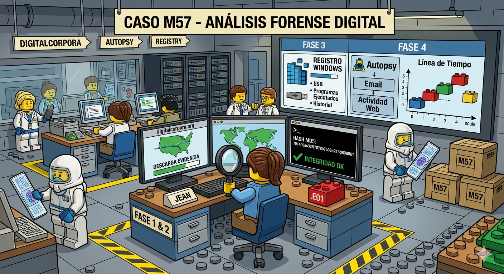

# Caso Forense

**M57-Jean**
- (https://digitalcorpora.org/corpora/scenarios/m57-jean/)

**Contexto:**

El caso M57-Jean es un escenario de entrenamiento en informática forense que simula la filtración de información confidencial en una empresa emergente llamada M57.Biz. La trama se centra en Jean, la Directora Financiera (CEO), cuya computadora es el foco de la investigación tras aparecer una hoja de cálculo con salarios y nombres de empleados clave en el sitio web de un competidor. Aunque Jean alega haber sido víctima de un hackeo, el ejercicio desafía a los analistas a utilizar imágenes de disco (en formato EnCase) para reconstruir la línea de tiempo, analizar correos electrónicos en Outlook y determinar si la filtración fue producto de un ataque externo (como spear phishing) o una amenaza interna.

# Desarrollo

[**Ver PDF**](LABORATORIO_M57_JON.pdf)
---

## Fuentes de apoyo:

- https://www.youtube.com/watch?v=zbTE5oK3EhA
- https://www.youtube.com/watch?v=gc3FRFC3CnA
- https://youtu.be/WB4xj8VYotk
- https://youtu.be/gWclBdzBzDM
- https://repository.unipiloto.edu.co/bitstream/handle/20.500.12277/11400/Caso%202009%20M57-Jean.pdf?sequence=4
- https://hasanka-amarasinghe.medium.com/digital-forensic-report-m57-jean-allison-case-data-breach-of-m57-biz-92396ec3a657
- https://www.dragonjar.org/laboratorio-informatica-forense-analisis-del-registro-de-windows.xhtml
- https://keepcoding.io/blog/como-funciona-el-registro-de-windows/
- https://youtu.be/iIJ2nFu1Pjc?si=ye98A9v1rvM3aUXD
- https://digitalperito.es/blog/autopsy-guia-analisis-forense-digital-2026/
- https://www.forensicfocus.com/articles/how-to-timeline-login-information-from-windows-event-logs/
- Visor pst: https://goldfynch.com/

