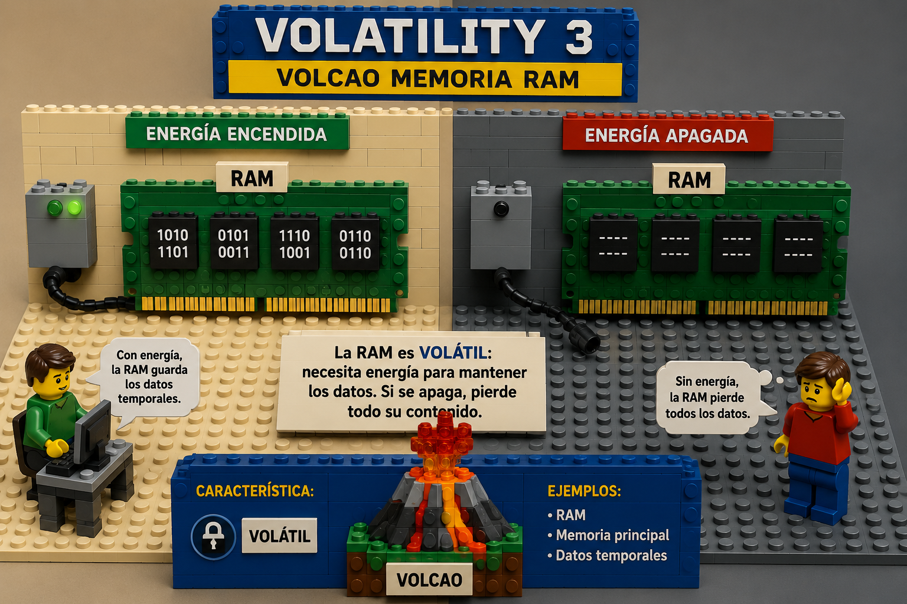

# VOLATILITY  3



Para iniciar y utilizar **Volatility 3** (la versión estándar y moderna de este framework de análisis de memoria) en un entorno Linux, se recomienda emplear un entorno virtual de Python. Esto evita conflictos con las librerías del sistema y garantiza un despliegue limpio.

A continuación, se detalla el procedimiento técnico para su instalación, configuración de símbolos y comandos iniciales de ejecución.

---

## 1. Requisitos previos e Instalación

Se deben instalar las dependencias necesarias de Python, clonar el repositorio oficial y configurar el entorno virtual:

```bash
# 1. Actualizar repositorios e instalar dependencias base
sudo apt update
sudo apt install python3 python3-venv python3-pip git -y

# 2. Clonar el repositorio oficial de Volatility 3
git clone https://github.com/volatilityfoundation/volatility3.git
cd volatility3

# 3. Crear y activar el entorno virtual de Python
python3 -m venv venv
source venv/bin/activate

# 4. Instalar Volatility 3 con todas sus dependencias optimizadas
pip install -e ".[full]"

```

Una vez completado este bloque, el entorno estará listo. Cada vez que se abra una nueva terminal, se deberá acceder a la carpeta y ejecutar `source venv/bin/activate`.

---

## 2. Descarga de Símbolos (Indispensable)

A diferencia de Volatility 2, la versión 3 no utiliza perfiles rígidos (`--profile`), sino **tablas de símbolos** en formato JSON (archivos ISF). Sin ellos, la herramienta no podrá interpretar correctamente las estructuras del sistema operativo bajo análisis.

Para descargar las tablas de símbolos oficiales de Windows y Linux, se ejecutan los siguientes comandos desde la raíz del directorio `volatility3`:

```bash
# Descargar e instalar símbolos para imágenes de Windows
wget https://downloads.volatilityfoundation.org/volatility3/symbols/windows.zip
unzip windows.zip -d volatility3/symbols/

# Descargar e instalar símbolos para imágenes de Linux
wget https://downloads.volatilityfoundation.org/volatility3/symbols/linux.zip
unzip linux.zip -d volatility3/symbols/

```

> **Nota para análisis de Linux avanzado:** Si el volcado de memoria pertenece a un kernel Linux muy específico o personalizado, se requerirá generar el archivo JSON Intermediate Symbol File (ISF) correspondiente utilizando la herramienta `dwarf2json` frente al kernel mapeado, o recurrir a repositorios comunitarios de símbolos.

---

## 3. Comandos Iniciales de Ejecución

Para verificar que la instalación responde de forma correcta y comenzar la inspección del volcado de memoria (por ejemplo, un archivo `.vmem`, `.raw` o `.img`), se hace uso del script principal `vol.py`:

### Verificar la instalación y ver la ayuda

```bash
python3 vol.py -h

```

### Identificar la información del sistema operativo de la muestra

Antes de ejecutar plugins específicos, se valida el volcado para comprobar qué sistemas operativos reconoce la herramienta en la capa física:

```bash
python3 vol.py -f /ruta/del/volcado_memoria.raw windows.info

```

*(Si la muestra corresponde a Linux, se sustituye por `linux.info`).*

### Listar procesos activos

Una vez determinado el sistema operativo, se ejecutan los plugins correspondientes para analizar los artefactos volátiles:

* **Para muestras de Windows:**
```bash
python3 vol.py -f /ruta/del/volcado_memoria.raw windows.pslist

```


* **Para muestras de Linux:**
```bash
python3 vol.py -f /ruta/del/volcado_memoria.raw linux.pslist

```


# Referencias:

- https://github.com/volatilityfoundation
- https://www.unfantasmaenelsistema.com/2026/05/volatility-3-analisis-forense-de-volcados-de-memoria-ram/
